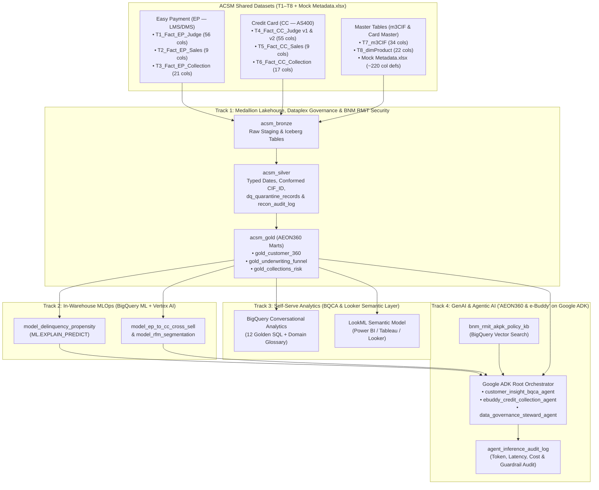

# AEON Credit Service Malaysia (ACSM) — Unified Data & AI Platform Workshop (`aeon-credit-gcp-workshop`)

> **End-to-End Google Agentic Data Cloud Demonstration** built on ACSM's Mock Datasets (`T1`–`T8` + `Mock Metadata.xlsx`) and mapped 1-to-1 against **RFP Annexure N (4 Workshop Tracks)**, **Annexure M (Operational Drivers)**, and **Part C Functional Requirements (`C1.1.1`–`C1.1.6`)**.

---

## 1. Executive Summary & Workshop Alignment (`Annexure N`)

AEON Credit Service Malaysia (ACSM) is modernizing its dual-silo data landscape (**Cloudera Hadoop / Informatica** for SAP & MOS 2.0 and **MS SQL Server / SSIS / Cognos BI DB** for AS400, LMS & DMS) into a unified, serverless, BNM RMiT- and PDPA-compliant **Data & AI Platform on Google Cloud**.

This repository contains the complete, runnable assets for all **4 Technical Workshop Tracks defined in RFP Annexure N**:

| Workshop Track (`Annexure N`) | ACSM Target Personas | Key Capabilities Demonstrated | Repository Directory |
| :--- | :--- | :--- | :--- |
| **Track 1: Data Platform, Governance & Modernization** | Data & AI Eng, BI, CDO, IT/Cloud Ops, Enterprise Arch, IT Security, Credit Control, Risk & Compliance | • **Medallion Lakehouse (`Bronze` $\rightarrow$ `Silver` $\rightarrow$ `Gold`)** on BigQuery & Apache Iceberg (`C1.1.1.3`)<br>• **Schema Evolution (`T4_Fact_CC_Judge` v1 $\rightarrow$ v2)** & Time Travel (`C1.1.1.4`)<br>• **Automated Metadata & Business Glossary** synced from `Mock Metadata.xlsx` (~220 columns) (`C1.1.1.8`, `C1.1.1.10`)<br>• **Declarative Data Quality & Quarantine (`dq_quarantine_records`)** (`C1.1.1.6`)<br>• **Dual-Run Automated Financial Reconciliation (`recon_audit_log`)** (`C1.1.1.13`, `C1.1.6.5`)<br>• **BNM RMiT & PDPA Fine-Grained Access Control** (Dynamic PII Masking + Malaysian State RLS + Right-to-Erasure) (`C1.1.1.24`, `C1.1.5.1`, `C1.1.5.3`) | [`track1_platform_governance/`](./track1_platform_governance/) |
| **Track 2: ML Development & MLOps** | Data Science, Credit Control | • **Feature Store (`ml_customer_feature_store`)** combining `m3CIF`, `dimProduct`, EP & CC history (`C1.1.4.2`)<br>• **Explainable Credit Delinquency & AKPK Propensity (`ML.EXPLAIN_PREDICT`)** (`M1.5.1`, `C1.1.4.9`)<br>• **EP $\leftrightarrow$ CC Cross-Sell Propensity & RFM Segmentation** (`M1.5.1`)<br>• **Transparent Polyglot Notebook (`SQL + Python`)** & Vertex AI Model Registry (`C1.1.4.1`–`C1.1.4.10`) | [`track2_ml_development/`](./track2_ml_development/) |
| **Track 3: Dashboard & Self-Service Analytics** | BI & Analytics, CDO, Credit Control, Customer Insight | • **AEON360 Gold Marts** (`gold_customer_360`, `gold_underwriting_funnel`, `gold_collections_risk`)<br>• **BigQuery Conversational Analytics (BQCA)** empowering the **65% non-technical business users** (`M1.4.4`) and eliminating the **150 ad-hoc queries/day ticket queue** (`M1.4.2`)<br>• **Governed LookML Semantic Layer** with inherited FGAC for Power BI, Tableau & Cognos (`C1.1.2.1`–`C1.1.2.10`) | [`track3_self_serve_analytics/`](./track3_self_serve_analytics/) |
| **Track 4: GenAI & Agentic AI Development** | Data & AI Engineering, CDO | • **Google ADK Multi-Agent System (`AEON360 & e-Buddy`)** (`C1.1.3.1`, `M1.5.4`)<br>• **BigQuery Native Vector DB (`VECTOR_SEARCH`)** indexing BNM RMiT & AKPK policies (`C1.1.3.6`)<br>• **AI Guardrails (Model Armor)** (`C1.1.3.5`) & **LLMOps Token/Latency/Cost Telemetry** (`C1.1.3.3`, `C1.1.3.7`) | [`track4_genai_agents/`](./track4_genai_agents/) |

---

## 2. Architecture Overview



---

## 3. Quick Start

### Prerequisites
```bash
export GOOGLE_CLOUD_PROJECT="your-gcp-project-id"
export GOOGLE_CLOUD_LOCATION="asia-southeast1"
export ACSM_DATA_DIR="/path/to/downloaded/acsm_mock_data"
```

### Step 1 — Run Track 1 (Ingestion, Auto-Metadata from `Mock Metadata.xlsx`, Medallion & Reconciliation)
```bash
python3 track1_platform_governance/01_ingest_and_metadata_sync.py \
  --project_id "${GOOGLE_CLOUD_PROJECT}" \
  --location "${GOOGLE_CLOUD_LOCATION}" \
  --data_dir "${ACSM_DATA_DIR}"

bq query --use_legacy_sql=false < track1_platform_governance/02_medallion_and_reconciliation.sql
bq query --use_legacy_sql=false < track1_platform_governance/03_bnm_rmit_pdpa_security.sql
```

### Step 2 — Run Track 3 & Track 2 (AEON360 Gold Marts + BigQuery ML Models)
```bash
bq query --use_legacy_sql=false < track3_self_serve_analytics/05_aeon360_gold_marts.sql
bq query --use_legacy_sql=false < track2_ml_development/04_bqml_credit_and_cross_sell.sql
```

### Step 3 — Run Track 4 (Vector DB, LLMOps Telemetry & Google ADK Multi-Agent Suite)
```bash
bq query --use_legacy_sql=false < track4_genai_agents/06_vector_db_and_llmops_tables.sql
adk web track4_genai_agents/aeon360_ebuddy_agent
```

### Step 4 — Launch the Interactive 4-Track Workshop Portal
```bash
streamlit run portal/app.py --server.port 8501
```
