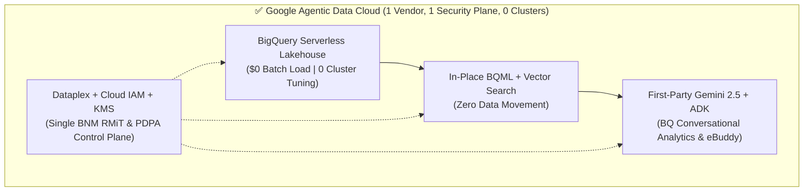

# Why Google Agentic Data Cloud for AEON Credit Service Malaysia (ACSM)
**Executive RFP One-Pager | Competitive Differentiation vs. Databricks & Snowflake**

> [!IMPORTANT]
> **The Executive Bottom Line for AEON Credit (ACSM)**
> Databricks and Snowflake are **third-party software overlays** that sit on top of rented cloud infrastructure and rented third-party AI models—forcing ACSM to pay **double markups** (Cloud VM/Storage + DBU/Warehouse Credits + AI Token Markups), manage **two separate security planes** for BNM RMiT audits, and **size/tune clusters**.
> **Google Cloud is the only partner that natively unifies Serverless Data (`BigQuery`), First-Party Frontier AI (`Gemini`), and Enterprise Agents (`Vertex AI & Conversational Analytics`) in a single, zero-infrastructure control plane**—with **$0.00 (`0 Bytes Billed`) batch data ingestion**.

---

## 1. Strategic Architecture Comparison: 1 Unified Platform vs. Multi-Vendor Overlays

| Evaluation Dimension (ACSM RFP) | **Google Agentic Data Cloud** (`BigQuery` + `Vertex AI` + `Gemini`) | **Databricks** (`Lakehouse` + `Unity Catalog` + `Mosaic AI`) | **Snowflake** (`Data Cloud` + `Snowpark` + `Cortex`) |
| :--- | :--- | :--- | :--- |
| **1. Data Ingestion Cost & Ops** *(Track 1 / C1.1.1)* | **$0.00 (`0 Bytes Billed`)** for batch `LOAD DATA` via Google's shared slot pool. **100% Serverless**—zero cluster sizing or spin-up delay. | **Charges twice**: Cloud VM compute + Databricks DBUs just to ingest CSV/Parquet files; requires cluster warm-up & runtime upgrades. | **Charges Warehouse Credits** (`COPY INTO` / Snowpipe) for every file loaded; requires manual `XS`–`4XL` warehouse sizing. |
| **2. Unified Data + ML + GenAI** *(Tracks 2–4 / C1.1.3–C1.1.5)* | **Zero Data Movement**: Underwriting (`T1`/`T4`), Cross-Sell (`EP`$\rightarrow$`CC`), `VECTOR_SEARCH`, and `AI.GENERATE` run **in-place in BigQuery SQL**. | **Spark-heavy**: Requires PySpark engineering, separate Mosaic Vector Index sync endpoints, and external model API wiring. | **Siloed Compute**: ML requires moving data into `Snowpark Container Services`; Cortex charges steep credit markups per token. |
| **3. Frontier AI Ownership** *(Track 3 & 4 / C1.1.5)* | **1st-Party Native (`Gemini`)**: Built by Google DeepMind with native grounding on BigQuery `Mock Metadata.xlsx` (226 column descriptions) & Bahasa Melayu/Manglish fluency. | **Rented 3rd-Party LLMs**: Does not own frontier models; wraps OpenAI/Anthropic/Llama with DBU markup and split IP indemnity. | **Rented 3rd-Party LLMs**: Wraps third-party models in Cortex; no native enterprise agent runtime comparable to Vertex AI ADK. |
| **4. Self-Serve BI & Spreadsheet Native** *(Track 3 / C1.1.4)* | **Connected Sheets + Looker + BQ Conversational Analytics**: Finance & Risk analysts pivot `1.4M+` `T1`–`T8` rows live in Google Sheets & natural language. | **Developer-Centric**: Built for Python/Spark data engineers; steep learning curve for ACSM Finance, Credit, and Collections business users. | **Proprietary Sight/BI Gaps**: Lacks native spreadsheet live-link (`Connected Sheets`) and Google Workspace (`Docs/Sheets/Chat`) integration. |
| **5. BNM RMiT & Malaysia PDPA Governance** *(Track 1 / C1.1.6)* | **Single Control Plane**: Cloud IAM + Dataplex Dynamic Masking (`T7_m3CIF` PII) + CMEK across **Singapore (`asia-southeast1`) & Malaysia (`asia-southeast2`)**. | **Dual Control Plane**: ACSM must audit & sync both Cloud IAM/Storage policies AND Databricks Unity Catalog ACLs for BNM RMiT. | **Dual Control Plane**: ACSM must govern both Cloud Storage IAM and Snowflake RBAC/Proprietary storage encryption layers. |
| **6. FinOps & TCO Predictability** *(Annexure M)* | **True Pay-Per-Query or Autoscaling Editions**: Scales to **zero** instantly; `0 B` billed on `LOAD DATA` and table `Preview`. | **High Idle & Engineering TCO**: Cluster spin-up lag (3–5 mins), idle node burn before auto-termination, and Spark tuning overhead. | **Credit Burn Traps**: Minimum 60-second billing per resume; a single unoptimized query keeps an `XL` warehouse burning credits. |

---

## 2. Direct Mapping to AEON Credit's 4 Official Workshop Tracks (`Annexure N`)

### **Track 1: Data Platform & Governance (`T1`–`T8` + `Mock Metadata.xlsx`)**
- **Proof in ACSM's Live Environment (`trustedtesterarvind`)**: All **8 core ACSM tables (`1,398,284` rows)** and **100% of their 226 column descriptions** were ingested into **`asia-southeast1` (Singapore)** using pure SQL (`CREATE TABLE` + `LOAD DATA OVERWRITE`) with **zero servers provisioned** and **`0 Bytes Billed` ($0 compute cost)**.
- **Why We Beat Databricks & Snowflake**: Native schema-level `OPTIONS(description=...)` feeds directly into Dataplex Knowledge Catalog and Gemini Conversational Analytics—eliminating the need to maintain separate external catalogs or write custom Python/PySpark ingestion pipelines.

### **Track 2: Machine Learning Lifecycle (`EP` & `CC` Credit Underwriting + Cross-Sell)**
- **The ACSM Challenge**: Siloed underwriting between Easy Payment (`T1_Fact_EP_Judge`) and Credit Cards (`T4_Fact_CC_Judge`), and slow model deployment from data science notebooks to production.
- **Why Google Wins**: With **BigQuery ML (`CREATE MODEL ... OPTIONS(model_type='BOOSTED_TREE_CLASSIFIER')`)**, ACSM's analysts train, evaluate (`ML.EVALUATE`), explain (`ML.EXPLAIN_PREDICT` for BNM fair-lending auditability), and batch/real-time score `100,000` CIF customers (`T7_m3CIF`) **directly in SQL where the data lives**—reducing model time-to-market from **months to hours**.

### **Track 3: Self-Serve Analytics (`AEON360` Customer 360 & Conversational Analytics)**
- **The ACSM Challenge**: Business teams wait days for IT/BI teams to write custom SQL joins across `T1`–`T8` (`Judge`, `Sales`, `Collection`, `m3CIF`, `dimProduct`).
- **Why Google Wins**: **BigQuery Conversational Analytics (Data Agent)** reads the **226 governed column descriptions** directly from `acsm_bronze` / `acsm_gold` to answer complex natural-language questions (*"Which EP motorcycle customers with 0 unpaid installments in T3 have the highest cross-sell propensity for a Gold Credit Card?"*) with verified SQL, instant charts, and zero data movement.

### **Track 4: GenAI & Agentic Workflows (`AEON360 eBuddy` Multi-Agent Assistant)**
- **The ACSM Challenge**: Collections officers (`T3_Fact_EP_Collection`, `T6_Fact_CC_Collection`) and Credit Underwriters need an intelligent assistant (`eBuddy`) that combines **structured customer data (`T1`–`T8`)** with **unstructured BNM/ACSM policy SOPs** under strict guardrails.
- **Why Google Wins**: Using **Google Agent Development Kit (ADK)** + **BigQuery Vector Search (`VECTOR_SEARCH`)** + **Vertex AI Model Armor**, ACSM deploys a production-grade `eBuddy` agent that retrieves real-time customer DPD/delinquency states alongside exact policy citations—with complete LLM telemetry (`acsm_gold.llm_observability_logs`) stored back in BigQuery.

---

## 3. Three Killer Questions to Ask in the RFP Executive Presentation

1. **On Zero-Cost Ingestion & Serverless Simplicity**:
   *"Today, we loaded all 1.4 million records across your 8 ACSM tables (`T1`–`T8`) in Singapore using a single SQL `LOAD DATA` statement with **0 servers provisioned and $0.00 (`0 Bytes Billed`) compute cost**. With Snowflake or Databricks, why pay warehouse credits or Spark DBU + VM charges just to load files into your own tables?"*
2. **On AI Readiness & Metadata Grounding**:
   *"Your `Mock Metadata.xlsx` defines 226 business columns across Easy Payment and Credit Cards. In BigQuery, those 226 column descriptions live natively inside the SQL DDL and automatically ground **Gemini Conversational Analytics** and **`eBuddy`**. Why stitch together a separate data vendor and a third-party LLM vendor when Google builds both BigQuery and Gemini?"*
3. **On BNM RMiT & Malaysia PDPA Auditability**:
   *"For BNM RMiT compliance, would your CISO prefer auditing **one unified Google Cloud IAM + Dataplex security plane** in Singapore (`asia-southeast1`) and Malaysia (`asia-southeast2`), or reconciling permissions across two separate vendors' control planes?"*
