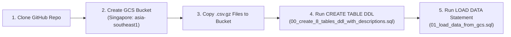

# Track 1: Data Platform & Governance — Serverless BigQuery Ingestion (Demo Flow 2)

This guide follows the zero-service-provisioning workflow for creating and loading the **8 AEON Credit Service Malaysia (ACSM) tables (`1,398,284` rows)** along with **100% of their table descriptions and 226 column descriptions** from `Mock Metadata.xlsx` in the **Singapore (`asia-southeast1`)** region.

---

## End-to-End 5-Step Flow



---

### Step 1: Clone the Repository & Set Parameters
Run in **Google Cloud Shell** (top-right `>_` icon in the GCP Console) or your workstation terminal:
```bash
# 1. Clone the workshop repository
git clone -b feature/acsm-e2e-workshop https://github.com/cloud-gtm/aeon-credit-gcp-workshop.git
cd aeon-credit-gcp-workshop

# 2. Set your parameterized Project ID and Singapore Region (asia-southeast1)
export PROJECT_ID="<YOUR_GCP_PROJECT_ID>"   # e.g., export PROJECT_ID="trustedtesterarvind"
export LOCATION="asia-southeast1"           # Always Singapore (asia-southeast1)
export BUCKET_NAME="acsm-workshop-landing-${PROJECT_ID}"

gcloud config set project "${PROJECT_ID}"
```

> [!TIP]
> **How to Verify on GCP Console UI (Cloud Shell Editor & Project Picker)**
> 1. In the top Google Cloud Console navigation bar, verify the **Project Picker** dropdown has your **`${PROJECT_ID}`** selected.
> 2. Click **Activate Cloud Shell (`>_`)** $\rightarrow$ click **Open Editor** (pencil icon).
> 3. In the left Explorer pane, expand **`aeon-credit-gcp-workshop/`**:
>    - Verify [`data/full_compressed/`](../data/full_compressed/) contains all 8 `.csv.gz` dataset files (`T1_Fact_EP_Judge.csv.gz` .. `T8_dimProduct.csv.gz`) and [`data/Mock Metadata.xlsx`](../data/Mock%20Metadata.xlsx).
>    - Verify [`track1_platform_governance/`](./) contains [`00_create_8_tables_ddl_with_descriptions.sql`](./00_create_8_tables_ddl_with_descriptions.sql) and [`01_load_data_from_gcs.sql`](./01_load_data_from_gcs.sql).

---

### Step 2: Create the Cloud Storage Landing Bucket (Singapore Region)
Create the regional GCS landing bucket in **`asia-southeast1` (Singapore)**:
```bash
gcloud storage buckets create "gs://${BUCKET_NAME}" \
  --project="${PROJECT_ID}" \
  --location="${LOCATION}" \
  --uniform-bucket-level-access
```

> [!TIP]
> **How to Verify on GCP Console UI (Cloud Storage Browser)**
> 1. Open **[Cloud Storage $\rightarrow$ Buckets](https://console.cloud.google.com/storage/browser)** in the GCP Console (for project `${PROJECT_ID}`).
> 2. Verify that bucket **`acsm-workshop-landing-${PROJECT_ID}`** appears in the bucket list with:
>    - **Location type**: `Region`
>    - **Location**: `asia-southeast1 (Singapore)`
>    - **Storage class**: `Standard`
>    - **Public access**: `Not public`

---

### Step 3: Copy the Compressed Data Files (`.csv.gz`) from the Repo to the Bucket
Upload all 8 compressed dataset files (`data/full_compressed/*.csv.gz`, `69 MB` total / `1.4M` rows) to the Singapore GCS bucket:
```bash
gcloud storage cp data/full_compressed/*.csv.gz "gs://${BUCKET_NAME}/full_compressed/"
```

> [!TIP]
> **How to Verify on GCP Console UI (Bucket Objects View)**
> 1. In **Cloud Storage $\rightarrow$ Buckets**, click into **`acsm-workshop-landing-${PROJECT_ID}` $\rightarrow$ `full_compressed/`**.
> 2. Click **Refresh** and verify all compressed `.csv.gz` files are listed in **`asia-southeast1 (Singapore)`** with `application/gzip` content type:
>    - `T1_Fact_EP_Judge.csv.gz` (`13.8 MB`)
>    - `T2_Fact_EP_Sales.csv.gz` (`1.4 MB`)
>    - `T3_Fact_EP_Collection.csv.gz` (`2.0 MB`)
>    - `T4_Fact_CC_Judge_v2.csv.gz` (`17.1 MB`)
>    - `T5_Fact_CC_Sales.csv.gz` (`5.9 MB`)
>    - `T6_Fact_CC_Collection.csv.gz` (`2.4 MB`)
>    - `T7_m3CIF.csv.gz` (`6.6 MB`)
>    - `T8_dimProduct.csv.gz` (`2.6 MB`)

---

### Step 4: Run the `CREATE TABLE` DDL Statement (With All Table & Column Descriptions)
Run [`track1_platform_governance/00_create_8_tables_ddl_with_descriptions.sql`](./00_create_8_tables_ddl_with_descriptions.sql) in **BigQuery Studio** (with query location set to `asia-southeast1`) or via the parameterized `bq query` command below:

```bash
sed "s/trustedtesterarvind/${PROJECT_ID}/g" \
  track1_platform_governance/00_create_8_tables_ddl_with_descriptions.sql \
  | bq query --project_id="${PROJECT_ID}" --location="${LOCATION}" --use_legacy_sql=false
```
*(If running directly inside **BigQuery Studio UI**: paste the contents of `00_create_8_tables_ddl_with_descriptions.sql`, replace `trustedtesterarvind` with your `${PROJECT_ID}`, verify **More $\rightarrow$ Query settings $\rightarrow$ Data location** is set to `asia-southeast1 (Singapore)`, and click **Run**).*

> [!TIP]
> **How to Verify on GCP Console UI (BigQuery Studio Explorer & Schema Tab)**
> 1. Open **[BigQuery Studio](https://console.cloud.google.com/bigquery)** in the GCP Console.
> 2. In the left **Explorer** pane, expand **`${PROJECT_ID}` $\rightarrow$ `acsm_bronze`**:
>    - Click on dataset **`acsm_bronze`** $\rightarrow$ verify **Data location** shows **`asia-southeast1`** (Singapore).
>    - Verify all 8 tables (`T1_Fact_EP_Judge` through `T8_dimProduct`) are listed under `acsm_bronze`.
> 3. Click on **`T1_Fact_EP_Judge`**:
>    - **Schema Tab**: Verify all **60 columns** display their business **Description** populated directly from `Mock Metadata.xlsx` (e.g., `CIF_NO` $\rightarrow$ *"Unique customer ID [Source Data Type: VARCHAR]"*).
>    - **Details Tab**: Verify **Data location** is `asia-southeast1`, **Description** shows *"The current (daily full refreshed) application status (Approved or Rejected) for EP products."*, and **Number of rows** is `0` (ready for data load).

---

### Step 5: Run the Serverless `LOAD DATA OVERWRITE` Statement (**$0 Load Cost / `0 B Billed`**)
Run [`track1_platform_governance/01_load_data_from_gcs.sql`](./01_load_data_from_gcs.sql) in **BigQuery Studio** (in `asia-southeast1`) or via the parameterized `bq query` command below:

```bash
sed "s/trustedtesterarvind/${PROJECT_ID}/g" \
  track1_platform_governance/01_load_data_from_gcs.sql \
  | bq query --project_id="${PROJECT_ID}" --location="${LOCATION}" --use_legacy_sql=false
```
*(If running directly inside **BigQuery Studio UI**: paste the contents of `01_load_data_from_gcs.sql`, replace `trustedtesterarvind` with your `${PROJECT_ID}`, ensure query location is `asia-southeast1 (Singapore)`, and click **Run**).*

> [!IMPORTANT]
> **Zero Compute Cost (`$0.00` / `0 Bytes Billed`) to Load Data into BigQuery**
> - **Official BigQuery Pricing ([BigQuery Data Ingestion Pricing](https://cloud.google.com/bigquery/pricing#loading_data))**: Batch loading data into BigQuery from Cloud Storage (via the `LOAD DATA` SQL statement, `bq load` CLI, or Load Jobs API) is **100% FREE (`$0.00`)** using BigQuery's default **shared slot pool**.
> - **Zero Cross-Region Egress + Preserved Governance**: Because both the GCS bucket (`gs://acsm-workshop-landing-${PROJECT_ID}`) and the BigQuery dataset (`acsm_bronze`) reside in **`asia-southeast1` (Singapore)**, there is **$0 data transfer/egress cost** and **$0 ingestion compute cost**, while **preserving 100% of the 226 column descriptions and table descriptions** created in Step 4.

> [!TIP]
> **How to Verify on GCP Console UI (4 Visual Checks in BigQuery Studio)**
> 1. **Verify `$0` Load Cost (`0 B Billed`) & Singapore Location**:
>    - In the bottom **Query results** pane after running `01_load_data_from_gcs.sql`, click **Job information** and point out **`Bytes billed: 0 B`** and **`Location: asia-southeast1`**.
> 2. **Verify Row Counts & Storage Size (`Details` Tab)**:
>    - Click on any table (e.g., **`T5_Fact_CC_Sales`** or **`T1_Fact_EP_Judge`**) $\rightarrow$ select the **Details** tab $\rightarrow$ verify **Data location** is **`asia-southeast1`**, **Number of rows** is **`535,925`** (`T5_Fact_CC_Sales`) / **`140,000`** (`T1_Fact_EP_Judge`; **`1,398,284` total rows** across all 8 tables), and **Table description** is present.
> 3. **Verify Loaded Records (`Preview` Tab — also $0 Cost)**:
>    - Click the **Preview** tab on any table to browse the loaded rows visually in the UI without running a `SELECT` query (`0 B billed`).
> 4. **Verify Preserved Column Descriptions (`Schema` Tab)**:
>    - Click the **Schema** tab again to show ACSM that **100% of the 226 column descriptions** defined in Step 4 remained intact after `LOAD DATA OVERWRITE`.
