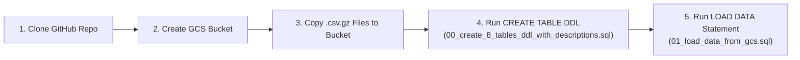

# Track 1: Data Platform & Governance — Serverless BigQuery Ingestion (Demo Flow 2)

This guide follows the zero-service-provisioning workflow for creating and loading the **8 AEON Credit Service Malaysia (ACSM) tables (`1,398,284` rows)** along with **100% of their table descriptions and 226 column descriptions** from `Mock Metadata.xlsx`.

---

## End-to-End 5-Step Flow



---

### Step 1: Clone the Repository
Run in **Google Cloud Shell** (top-right `>_` icon in the GCP Console) or your workstation terminal:
```bash
git clone -b feature/acsm-e2e-workshop https://github.com/cloud-gtm/aeon-credit-gcp-workshop.git
cd aeon-credit-gcp-workshop
```

> [!TIP]
> **How to Verify on GCP Console UI (Cloud Shell Editor)**
> 1. In the Google Cloud Console top bar, click **Activate Cloud Shell (`>_`)** $\rightarrow$ click **Open Editor** (pencil icon).
> 2. In the left Explorer pane, expand **`aeon-credit-gcp-workshop/`**:
>    - Verify [`data/full_compressed/`](../data/full_compressed/) shows the `.csv.gz` dataset files (`T1_Fact_EP_Judge.csv.gz` .. `T8_dimProduct.csv.gz`) and [`data/Mock Metadata.xlsx`](../data/Mock%20Metadata.xlsx).
>    - Verify [`track1_platform_governance/`](./) contains [`00_create_8_tables_ddl_with_descriptions.sql`](./00_create_8_tables_ddl_with_descriptions.sql) and [`01_load_data_from_gcs.sql`](./01_load_data_from_gcs.sql).

---

### Step 2: Create the Cloud Storage Landing Bucket
Create the GCS landing bucket in your GCP project (`trustedtesterarvind`):
```bash
export PROJECT_ID="trustedtesterarvind"
export BUCKET_NAME="acsm-workshop-landing-${PROJECT_ID}"

gcloud storage buckets create "gs://${BUCKET_NAME}" \
  --project="${PROJECT_ID}" \
  --location="US"
```

> [!TIP]
> **How to Verify on GCP Console UI (Cloud Storage Browser)**
> 1. Open **[Cloud Storage $\rightarrow$ Buckets](https://console.cloud.google.com/storage/browser?project=trustedtesterarvind)** in the GCP Console.
> 2. Verify that bucket **`acsm-workshop-landing-trustedtesterarvind`** appears in the bucket list with:
>    - **Location type**: `Multi-region (us)`
>    - **Storage class**: `Standard`
>    - **Public access**: `Not public` (enforced by default).

---

### Step 3: Copy the Compressed Data Files (`.csv.gz`) from the Repo to the Bucket
Upload all 8 compressed dataset files (`data/full_compressed/*.csv.gz`, `69 MB` total / `1.4M` rows) to the GCS bucket:
```bash
gcloud storage cp data/full_compressed/*.csv.gz "gs://${BUCKET_NAME}/full_compressed/"
```

> [!TIP]
> **How to Verify on GCP Console UI (Bucket Objects View)**
> 1. Open **[Cloud Storage $\rightarrow$ `acsm-workshop-landing-trustedtesterarvind/full_compressed/`](https://console.cloud.google.com/storage/browser/acsm-workshop-landing-trustedtesterarvind/full_compressed?project=trustedtesterarvind)**.
> 2. Click **Refresh** and verify all compressed `.csv.gz` files are listed with their sizes and `application/gzip` content type:
>    - `T1_Fact_EP_Judge.csv.gz` (`13.8 MB`)
>    - `T2_Fact_EP_Sales.csv.gz` (`1.4 MB`)
>    - `T3_Fact_EP_Collection.csv.gz` (`2.0 MB`)
>    - `T4_Fact_CC_Judge_v2.csv.gz` (`17.1 MB`)
>    - `T5_Fact_CC_Sales.csv.gz` (`5.9 MB`)
>    - `T6_Fact_CC_Collection.csv.gz` (`2.4 MB`)
>    - `T7_m3CIF.csv.gz` (`6.6 MB`)
>    - `T8_dimProduct.csv.gz` (`2.6 MB`)

---

### Step 4: Run the `CREATE TABLE` DDL Statement (With All Table & Column Descriptions)
Open **BigQuery Studio** in the Google Cloud Console (or use `bq query`) and run:
- **File**: [`track1_platform_governance/00_create_8_tables_ddl_with_descriptions.sql`](./00_create_8_tables_ddl_with_descriptions.sql)

*(CLI equivalent)*:
```bash
bq query --project_id="${PROJECT_ID}" --use_legacy_sql=false \
  < track1_platform_governance/00_create_8_tables_ddl_with_descriptions.sql
```

> [!TIP]
> **How to Verify on GCP Console UI (BigQuery Studio Explorer & Schema Tab)**
> 1. Open **[BigQuery Studio](https://console.cloud.google.com/bigquery?project=trustedtesterarvind)** in the GCP Console.
> 2. In the left **Explorer** pane, expand **`trustedtesterarvind` $\rightarrow$ `acsm_bronze`** and verify all 8 tables (`T1_Fact_EP_Judge` through `T8_dimProduct`) are listed.
> 3. Click on **`T1_Fact_EP_Judge`**:
>    - **Schema Tab**: Verify all **60 columns** display their business **Description** column populated directly from `Mock Metadata.xlsx` (e.g., `CIF_NO` $\rightarrow$ *"Unique customer ID [Source Data Type: VARCHAR]"*).
>    - **Details Tab**: Verify **Description** shows *"The current (daily full refreshed) application status (Approved or Rejected) for EP products."* and **Number of rows** is currently `0` (ready for data load).

---

### Step 5: Run the Serverless `LOAD DATA OVERWRITE` Statement (**$0 Load Cost / `0 B Billed`**)
In **BigQuery Studio** (or via `bq query`), run:
- **File**: [`track1_platform_governance/01_load_data_from_gcs.sql`](./01_load_data_from_gcs.sql)

*(CLI equivalent)*:
```bash
bq query --project_id="${PROJECT_ID}" --use_legacy_sql=false \
  < track1_platform_governance/01_load_data_from_gcs.sql
```

> [!IMPORTANT]
> **Zero Compute Cost (`$0.00` / `0 Bytes Billed`) to Load Data into BigQuery**
> - **Official BigQuery Pricing ([BigQuery Data Ingestion Pricing](https://cloud.google.com/bigquery/pricing#loading_data))**: Batch loading data into BigQuery from Cloud Storage (via the `LOAD DATA` SQL statement, `bq load` CLI, or Load Jobs API) is **100% FREE (`$0.00`)** using BigQuery's default **shared slot pool**.
> - **Zero Infrastructure + Preserved Governance**: BigQuery automatically decompresses all 8 `.csv.gz` files, loads all **1,398,284 rows** at **$0 ingestion compute cost**, and **preserves 100% of the 226 column descriptions and table descriptions** created in Step 4. *(Note: Standard BigQuery storage rates apply after ingestion, with the first 10 GB/month free; the shared batch pool is used automatically unless a dedicated `LOAD` slot reservation is explicitly assigned).*

> [!TIP]
> **How to Verify on GCP Console UI (4 Visual Checks in BigQuery Studio)**
> 1. **Verify `$0` Load Cost (`0 B Billed`)**:
>    - In the bottom **Query results** pane after running `01_load_data_from_gcs.sql`, click **Job information** (or expand the multi-statement script results) and point out **`Bytes billed: 0 B`**.
> 2. **Verify Row Counts & Storage Size (`Details` Tab)**:
>    - Click on any table (e.g., **`T5_Fact_CC_Sales`** or **`T1_Fact_EP_Judge`**) $\rightarrow$ select the **Details** tab $\rightarrow$ verify **Number of rows** (`535,925` rows in `T5_Fact_CC_Sales`, `140,000` rows in `T1_Fact_EP_Judge`; `1,398,284` total rows across all 8 tables) and **Table description** are present.
> 3. **Verify Loaded Records (`Preview` Tab — also $0 Cost)**:
>    - Click the **Preview** tab on any table to browse the loaded rows visually in the UI without running a `SELECT` query (`0 B billed`).
> 4. **Verify Preserved Column Descriptions (`Schema` Tab)**:
>    - Click the **Schema** tab again to show ACSM that **100% of the 226 column descriptions** defined in Step 4 remained intact after `LOAD DATA OVERWRITE`.
