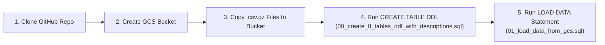

# Track 1: Data Platform & Governance — Serverless BigQuery Ingestion (Demo Flow 2)

This guide follows the zero-service-provisioning workflow for creating and loading the **8 AEON Credit Service Malaysia (ACSM) tables (`1,398,284` rows)** along with **100% of their table descriptions and 226 column descriptions** from `Mock Metadata.xlsx`.

---

## End-to-End 5-Step Flow



### Step 1: Clone the Repository
Run in Cloud Shell or your workstation terminal:
```bash
git clone -b feature/acsm-e2e-workshop https://github.com/cloud-gtm/aeon-credit-gcp-workshop.git
cd aeon-credit-gcp-workshop
```

### Step 2: Create the Cloud Storage Landing Bucket
Create the GCS landing bucket in your GCP project (`trustedtesterarvind`):
```bash
export PROJECT_ID="trustedtesterarvind"
export BUCKET_NAME="acsm-workshop-landing-${PROJECT_ID}"

gcloud storage buckets create "gs://${BUCKET_NAME}" \
  --project="${PROJECT_ID}" \
  --location="US"
```

### Step 3: Copy the Compressed Data Files (`.csv.gz`) from the Repo to the Bucket
Upload all 8 compressed dataset files (`data/full_compressed/*.csv.gz`, `69 MB` total / `1.4M` rows) to the GCS bucket:
```bash
gcloud storage cp data/full_compressed/*.csv.gz "gs://${BUCKET_NAME}/full_compressed/"
```

### Step 4: Run the `CREATE TABLE` DDL Statement (With All Table & Column Descriptions)
Open **BigQuery Studio** in the Google Cloud Console (or use `bq query`) and run:
- **File**: [`track1_platform_governance/00_create_8_tables_ddl_with_descriptions.sql`](./00_create_8_tables_ddl_with_descriptions.sql)

*(CLI equivalent)*:
```bash
bq query --project_id="${PROJECT_ID}" --use_legacy_sql=false \
  < track1_platform_governance/00_create_8_tables_ddl_with_descriptions.sql
```
> **Result**: Creates the `acsm_bronze` dataset and all 8 tables (`T1_Fact_EP_Judge` .. `T8_dimProduct`) with **100% of Table Descriptions and all 226 Column Descriptions** stored in BigQuery's catalog.

### Step 5: Run the Serverless `LOAD DATA OVERWRITE` Statement (**$0 Load Cost / `0 B Billed`**)
In **BigQuery Studio** (or via `bq query`), run:
- **File**: [`track1_platform_governance/01_load_data_from_gcs.sql`](./01_load_data_from_gcs.sql)

*(CLI equivalent)*:
```bash
bq query --project_id="${PROJECT_ID}" --use_legacy_sql=false \
  < track1_platform_governance/01_load_data_from_gcs.sql
```

> [!IMPORTANT]
> **Zero Compute Cost (`$0.00` / `0 Bytes Billed`) to Load Data into BigQuery**
> - **Official BigQuery Pricing ([BigQuery Data Ingestion Pricing](https://cloud.google.com/bigquery/pricing#loading_data))**: Batch loading data into BigQuery from Cloud Storage (via the `LOAD DATA` SQL statement, `bq load` CLI, or Load Jobs API) is **100% FREE (`$0.00`)** using BigQuery's default **shared slot pool**.
> - **What to Show ACSM in BigQuery Studio**: After clicking **Run** on `01_load_data_from_gcs.sql`, click the **Job Information** tab in BigQuery Studio and point out **`Bytes billed: 0 B`**.
> - **Zero Infrastructure + Preserved Governance**: BigQuery automatically decompresses all 8 `.csv.gz` files, loads all **1,398,284 rows** at **$0 ingestion compute cost**, and **preserves 100% of the 226 column descriptions and table descriptions** created in Step 4. *(Note: Standard BigQuery storage rates apply after ingestion, with the first 10 GB/month free; the shared batch pool is used automatically unless a dedicated `LOAD` slot reservation is explicitly assigned).*
