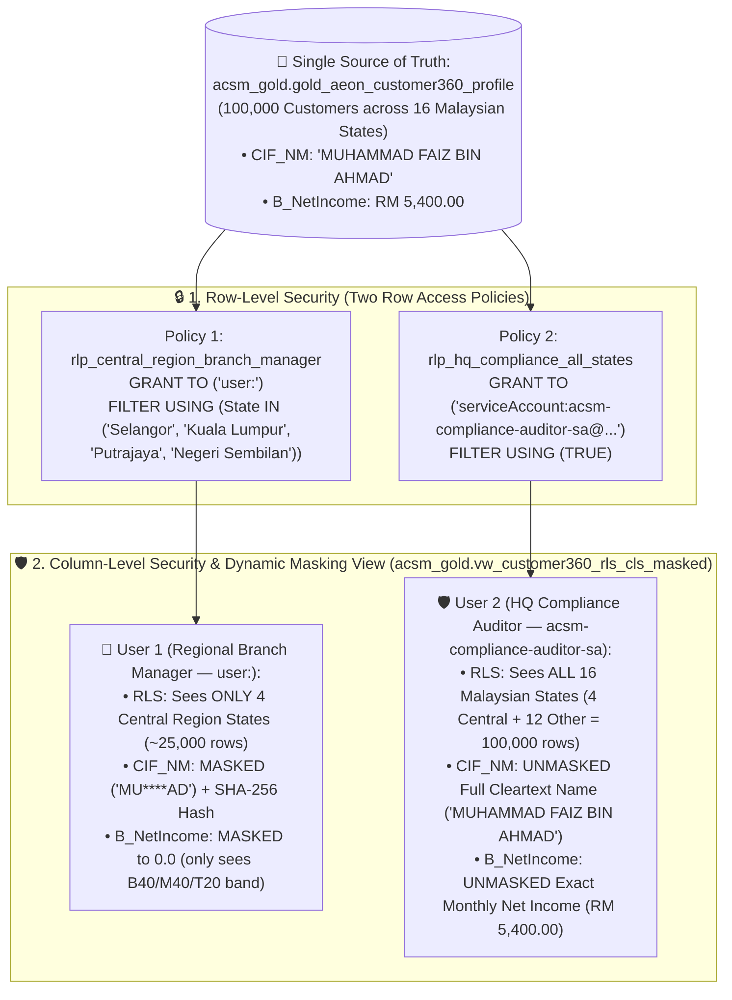

# Track 1 (Notebook 03) Walkthrough: Fine-Grained Data Governance — RLS, CLS & Dynamic Data Masking in Pure BigQuery SQL

**Notebook**: [`03_Governance_Security_and_Data_Quality.ipynb`](../notebook/03_Governance_Security_and_Data_Quality.ipynb)
**Parked Modules Notebook (Can be discarded at end)**: [`03b_Parked_Dataplex_DLP_and_Data_Quality.ipynb`](../notebook/03b_Parked_Dataplex_DLP_and_Data_Quality.ipynb)
**SQL Script**: [`03_bnm_rmit_pdpa_security.sql`](../sql/03_bnm_rmit_pdpa_security.sql)
**Identity Provisioning Helper**: [`setup_rls_cls_identities.py`](../scripts/setup_rls_cls_identities.py)
**Target Region**: `asia-southeast1` (Singapore)
**ACSM RFP Clauses**: `C1.1.1.24`, `C1.1.5.3`, `C1.1.5.5`, `C1.1.2.2`, `C1.1.1.8`, `C1.1.1.10`

---

## 1. Executive Summary & Two-Identity Verification Architecture

Notebook 03 demonstrates **Row-Level Security (RLS)**, **Column-Level Security (CLS)**, and **Dynamic Data Masking** in **pure BigQuery SQL** on the single Gold Customer 360 table (`acsm_gold.gold_aeon_customer360_profile`), aligned with **Bank Negara Malaysia (BNM) RMiT** and **Malaysian PDPA 2010**.

To prove that BigQuery returns different results from the **exact same SQL query** depending on who executes the query, **Step 0** automatically configures **two distinct governance identities**:
1. **👤 User 1 — Regional Branch Manager (Restricted Analyst)**: `user:<USER_EMAIL>` (your active logged-in workshop user, executed via `%%bigquery`)
2. **🛡️ User 2 — Head Office Compliance & Risk Auditor (Full Access)**: `serviceAccount:acsm-compliance-auditor-sa@<PROJECT_ID>.iam.gserviceaccount.com` (auto-provisioned in Step 0 and executed via `%%bigquery_as_sa`)




---

## 2. Step-by-Step Pure SQL Walkthrough

| Step | Notebook Cell Magic | Identity Running Query | What Happens & What You Observe |
| :--- | :--- | :--- | :--- |
| **Step 0** | Python (`%run setup_rls_cls_identities.py`) | Admin Setup | Auto-detects `PROJECT_ID`, clears any prior Row Access Policies, provisions **User 2** (`serviceAccount:acsm-compliance-auditor-sa@<PROJECT_ID>.iam.gserviceaccount.com`), and registers the `%%bigquery_as_sa` SQL magic. |
| **Step 1.1** | `%%bigquery` | **User 1 (`user:<USER_EMAIL>`)** | **Baseline Inspection (Before Security Policies)**: Queries `acsm_gold.gold_aeon_customer360_profile` showing **`100,000` visible customers across all `16` Malaysian states**, with raw unmasked customer names (`CIF_NM`) and exact monthly net income (`B_NetIncome`). |
| **Step 1.2a** | `%%bigquery` | Policy DDL | **Apply Both Row-Level Security (RLS) Policies (`CREATE OR REPLACE ROW ACCESS POLICY`)**:<br>1. `rlp_central_region_branch_manager` $\rightarrow$ granted to **User 1 (`user:<USER_EMAIL>`)**, filtering `State IN ('Selangor', 'Kuala Lumpur', 'Putrajaya', 'Negeri Sembilan')`.<br>2. `rlp_hq_compliance_all_states` $\rightarrow$ granted to **User 2 (`serviceAccount:acsm-compliance-auditor-sa@<PROJECT_ID>.iam.gserviceaccount.com`)**, filtering `TRUE` (all 16 states). |
| **Step 1.2b** | `%%bigquery` | **👤 User 1 (`user:<USER_EMAIL>`)** | **Verify RLS as User 1 (Restricted Regional Manager)**: Runs `SELECT State, COUNT(*) ... FROM acsm_gold.gold_aeon_customer360_profile GROUP BY State` with **no `WHERE` clause** — returns **ONLY 4 rows** (`Selangor`, `Kuala Lumpur`, `Putrajaya`, `Negeri Sembilan` — `~25,000` customers). All 12 other Malaysian states are filtered out! |
| **Step 1.2c** | `%%bigquery_as_sa` | **🛡️ User 2 (`acsm-compliance-auditor-sa`)** | **Verify RLS as User 2 (HQ Compliance Auditor) Running the Exact Same Query**: Runs the **exact same `SELECT State, COUNT(*) ...` query** as `acsm-compliance-auditor-sa@<PROJECT_ID>.iam.gserviceaccount.com` — returns **ALL 16 Malaysian states** (the 4 Central Region states **PLUS all 12 other Malaysian states**: `Johor`, `Penang`, `Perak`, `Kedah`, `Kelantan`, `Melaka`, `Pahang`, `Perlis`, `Sabah`, `Sarawak`, `Terengganu`, `Labuan` = `100,000` customers)! |
| **Step 1.3a** | `%%bigquery` | View DDL | **Apply Column-Level Security & Dynamic Data Masking (`CREATE OR REPLACE VIEW acsm_gold.vw_customer360_rls_cls_masked`)**: Evaluates `SESSION_USER()` dynamically so **User 1** receives masked PII (`'MU****AD'`, SHA-256 hash, `0.0` net income) while **User 2 (`acsm-compliance-auditor-sa`)** receives unmasked cleartext `CIF_NM` and exact `B_NetIncome`. |
| **Step 1.3b** | `%%bigquery` | **👤 User 1 (`user:<USER_EMAIL>`)** | **Verify CLS + RLS as User 1 (Restricted Regional Manager)**: Queries `acsm_gold.vw_customer360_rls_cls_masked` as `user:<USER_EMAIL>` — returns **only Central Region states**, **masked customer names (`'MU****AD'`)**, **SHA-256 hashes**, and **masked net income (`0.0`)**. |
| **Step 1.3c** | `%%bigquery_as_sa` | **🛡️ User 2 (`acsm-compliance-auditor-sa`)** | **Verify CLS + RLS as User 2 (HQ Compliance Auditor) Running the Exact Same Query**: Runs the **exact same SQL query** on `acsm_gold.vw_customer360_rls_cls_masked` as `acsm-compliance-auditor-sa@<PROJECT_ID>.iam.gserviceaccount.com` — returns **all 16 Malaysian states**, **unmasked full customer names (`'MUHAMMAD FAIZ BIN AHMAD'`)**, and **unmasked exact monthly net income (`RM 5,400.00`)**! |
| **Step 1.4** | `%%bigquery` | Policy Reset | **1-Click Pure SQL Policy Reset (`DROP ALL ROW ACCESS POLICIES`)**: Drops the Row Access Policies on `acsm_gold.gold_aeon_customer360_profile` and verifies all **`100,000` customers across all `16` Malaysian states** are restored for downstream Notebooks 04–05 and Tracks 2–4. |
| **Step 1.5a** | Python (`sync_business_glossary.py`) | Catalog Sync | Reads [`business_glossary_acsm.yaml` ↗](https://github.com/arvind-dhariwal/aeon-credit-gcp-workshop/blob/main/track1_platform_governance/scripts/business_glossary_acsm.yaml), provisions/updates the Dataplex Business Glossary (`acsm-enterprise-credit-glossary`), 4 Categories, and 10 Terms in `asia-southeast1`, and materializes `acsm_gold.business_glossary_catalog`. |
| **Step 1.5b** | `%%bigquery` | **User 1 (`user:<USER_EMAIL>`)** | Queries all **10 standardized ACSM business terms**, their categories, synonyms, linked BigQuery columns, and assigned data stewards in pure BigQuery SQL. |

---

### 2.1 Deep-Dive: How to Validate Row-Level Security (RLS) with Both Users (`Step 1.2a` – `Step 1.2c`)

#### A. Two Row Access Policies Created in `Step 1.2a`
```sql
-- Policy 1: Restrict User 1 (Logged-in Regional Branch Manager) to ONLY the 4 Central Region states
EXECUTE IMMEDIATE FORMAT("""
  CREATE OR REPLACE ROW ACCESS POLICY rlp_central_region_branch_manager
  ON `acsm_gold.gold_aeon_customer360_profile`
  GRANT TO ('%s:%s')
  FILTER USING (State IN ('Selangor', 'Kuala Lumpur', 'Putrajaya', 'Negeri Sembilan'))
""", IF(ENDS_WITH(SESSION_USER(), '.gserviceaccount.com'), 'serviceAccount', 'user'), SESSION_USER());

-- Policy 2: Grant User 2 (HQ Compliance Auditor SA) visibility across ALL 16 Malaysian states
EXECUTE IMMEDIATE FORMAT("""
  CREATE OR REPLACE ROW ACCESS POLICY rlp_hq_compliance_all_states
  ON `acsm_gold.gold_aeon_customer360_profile`
  GRANT TO ('serviceAccount:acsm-compliance-auditor-sa@%s.iam.gserviceaccount.com')
  FILTER USING (TRUE)
""", @@project_id);
```

#### B. Exact Same RLS Validation Query Run by Both Users (`Step 1.2b` vs `Step 1.2c`)
Both **Step 1.2b** (`%%bigquery` as **User 1: `user:<USER_EMAIL>`**) and **Step 1.2c** (`%%bigquery_as_sa` as **User 2: `serviceAccount:acsm-compliance-auditor-sa@<PROJECT_ID>.iam.gserviceaccount.com`**) execute this **exact same SQL query**:
```sql
SELECT
  SESSION_USER() AS queried_by_user,
  COUNT(DISTINCT State) OVER () AS total_visible_states,
  SUM(COUNT(*)) OVER () AS total_visible_customers_across_states,
  State AS visible_malaysian_state,
  COUNT(*) AS visible_customers,
  ROUND(AVG(B_AnnualIncome), 2) AS avg_annual_income_rm,
  ROUND(AVG(avg_ep_dsr), 2) AS avg_dsr_pct
FROM `acsm_gold.gold_aeon_customer360_profile`
GROUP BY State
ORDER BY visible_customers DESC;
```

#### C. Side-by-Side Comparison of RLS Query Results
| Dimension | 👤 Step 1.2b Result — User 1 (`user:<USER_EMAIL>`) | 🛡️ Step 1.2c Result — User 2 (`acsm-compliance-auditor-sa@<PROJECT_ID>.iam.gserviceaccount.com`) |
| :--- | :--- | :--- |
| **Active RLS Policy** | `rlp_central_region_branch_manager` | `rlp_hq_compliance_all_states` |
| **Row Filter Condition** | `State IN ('Selangor', 'Kuala Lumpur', 'Putrajaya', 'Negeri Sembilan')` | `TRUE` (Unrestricted — all states) |
| **`total_visible_states`** | **`4` Malaysian States** | **`16` Malaysian States** (4 Central + **12 Other Malaysian States**) |
| **`total_visible_customers_across_states`** | **`~25,000` Customers** | **`100,000` Customers** |
| **Visible States Returned** | `Selangor`, `Kuala Lumpur`, `Putrajaya`, `Negeri Sembilan` *(12 other states hidden)* | `Selangor`, `Kuala Lumpur`, `Putrajaya`, `Negeri Sembilan` **PLUS** `Johor`, `Penang`, `Perak`, `Kedah`, `Kelantan`, `Melaka`, `Pahang`, `Perlis`, `Sabah`, `Sarawak`, `Terengganu`, `Labuan` |

---

### 2.2 Deep-Dive: How to Validate Column-Level Security (CLS) & Dynamic Data Masking with Both Users (`Step 1.3a` – `Step 1.3c`)

#### A. Governed CLS View Created in `Step 1.3a` (`acsm_gold.vw_customer360_rls_cls_masked`)
```sql
CREATE OR REPLACE VIEW `acsm_gold.vw_customer360_rls_cls_masked` AS
SELECT
  CIF_ID,
  -- Rule 1: Partial String Redaction ('MU****AD' for User 1; Full Cleartext Name for User 2)
  CASE
    WHEN SESSION_USER() LIKE 'acsm-compliance-auditor-sa@%'
      OR SESSION_USER() LIKE '%compliance%'
      OR SESSION_USER() LIKE '%credit-control%'
      THEN CIF_NM
    ELSE CONCAT(SUBSTR(CIF_NM, 1, 2), '****', SUBSTR(CIF_NM, -2))
  END AS cif_nm_partial_masked,
  -- Rule 2: Cryptographic SHA-256 Hash Masking
  TO_HEX(SHA256(CAST(CIF_NM AS STRING))) AS cif_nm_sha256_masked,
  State AS rls_central_region_state,
  Occupation,
  -- Rule 3: Default Value (0.0) Masking on Monthly Net Income (0.0 for User 1; Exact MYR Income for User 2)
  CASE
    WHEN SESSION_USER() LIKE 'acsm-compliance-auditor-sa@%'
      OR SESSION_USER() LIKE '%compliance%'
      OR SESSION_USER() LIKE '%credit-control%'
      THEN B_NetIncome
    ELSE 0.0
  END AS net_income_masked_default_0,
  -- Rule 4: Generalized BNM Household Income Tier Band (Safe for All Users)
  CASE
    WHEN B_NetIncome < 3000 THEN 'B40 (< RM 3,000)'
    WHEN B_NetIncome BETWEEN 3000 AND 7000 THEN 'M40 (RM 3,000 - RM 7,000)'
    ELSE 'T20 (> RM 7,000)'
  END AS bnm_income_tier_band,
  B_AnnualIncome AS annual_income_unmasked_comparison,
  avg_ep_dsr,
  active_card_count
FROM `acsm_gold.gold_aeon_customer360_profile`;
```

#### B. Exact Same CLS + RLS Query Run by Both Users (`Step 1.3b` vs `Step 1.3c`)
Both **Step 1.3b** (`%%bigquery` as **User 1: `user:<USER_EMAIL>`**) and **Step 1.3c** (`%%bigquery_as_sa` as **User 2: `serviceAccount:acsm-compliance-auditor-sa@<PROJECT_ID>.iam.gserviceaccount.com`**) execute this **exact same SQL query**:
```sql
SELECT
  SESSION_USER() AS queried_by_user,
  CIF_ID,
  cif_nm_partial_masked,
  SUBSTR(cif_nm_sha256_masked, 1, 16) AS cif_nm_sha256_prefix,
  rls_central_region_state,
  Occupation,
  net_income_masked_default_0,
  bnm_income_tier_band,
  avg_ep_dsr,
  active_card_count
FROM `acsm_gold.vw_customer360_rls_cls_masked`
ORDER BY CIF_ID
LIMIT 10;
```

#### C. Side-by-Side Comparison of CLS + RLS Query Results
| Output Column | 👤 Step 1.3b Result — User 1 (`user:<USER_EMAIL>`) | 🛡️ Step 1.3c Result — User 2 (`acsm-compliance-auditor-sa@<PROJECT_ID>.iam.gserviceaccount.com`) |
| :--- | :--- | :--- |
| **`queried_by_user`** | `<USER_EMAIL>` | `acsm-compliance-auditor-sa@<PROJECT_ID>.iam.gserviceaccount.com` |
| **`rls_central_region_state` (RLS)** | **ONLY 4 Central Region States** (`Selangor`, `Kuala Lumpur`, `Putrajaya`, `Negeri Sembilan`) | **All 16 Malaysian States** (`Johor`, `Penang`, `Sabah`, `Sarawak`, `Selangor`, etc.) |
| **`cif_nm_partial_masked` (CLS Rule 1)** | **MASKED (`'MU****AD'`, `'NU****IL'`)** | **UNMASKED Cleartext (`'MUHAMMAD FAIZ BIN AHMAD'`, `'NURUL AINA BINTI ISMAIL'`)** |
| **`cif_nm_sha256_prefix` (CLS Rule 2)** | **SHA-256 Hash (`'8f4b2c91e03a1d7c'`)** | **SHA-256 Hash (`'8f4b2c91e03a1d7c'`)** |
| **`net_income_masked_default_0` (CLS Rule 3)** | **MASKED to `0.0`** | **UNMASKED Exact Monthly Net Income (`5400.00`, `8250.00` MYR)** |
| **`bnm_income_tier_band` (Safe Band)** | `M40 (RM 3,000 - RM 7,000)` / `T20 (> RM 7,000)` | `M40 (RM 3,000 - RM 7,000)` / `T20 (> RM 7,000)` |

---

## 3. Dataplex Business Glossary Design & Walkthrough Plan (`RFP C1.1.1.8` & `C1.1.1.10`)

In Google Cloud **Dataplex Universal Catalog (Knowledge Catalog)**, a **Business Glossary** bridges technical column names (`CIF_ID`, `B_NetIncome`, `avg_ep_dsr`, `ep_unpaid_osp`) and standardized AEON Credit business definitions. Furthermore, **BigQuery Conversational Analytics (BQCA) Data Agents automatically import up to 10 attached Business Glossary terms per table** to resolve domain acronyms during natural-language SQL generation.

### 3.1 Declarative YAML Config & Top-Level Glossary Resource
- **Declarative YAML File**: [`track1_platform_governance/scripts/business_glossary_acsm.yaml`](../scripts/business_glossary_acsm.yaml) ([View on GitHub ↗](https://github.com/arvind-dhariwal/aeon-credit-gcp-workshop/blob/main/track1_platform_governance/scripts/business_glossary_acsm.yaml))
- **Glossary ID**: `acsm-enterprise-credit-glossary`
- **Display Name**: `ACSM Enterprise Consumer Finance & Regulatory Glossary`
- **Region**: `asia-southeast1` (Singapore)
- **Direct Glossary Deep Link (Auto-rendered with `PROJECT_ID` in Notebook `Step 1.5a` output)**:
  `https://console.cloud.google.com/dataplex/dp-glossaries/projects/<PROJECT_ID>/locations/asia-southeast1/glossaries/acsm-enterprise-credit-glossary?project=<PROJECT_ID>`
- **All Glossaries Console Link**: [`https://console.cloud.google.com/dataplex/dp-glossaries`](https://console.cloud.google.com/dataplex/dp-glossaries) (or **BigQuery $\rightarrow$ Governance $\rightarrow$ Business Glossary**)

### 3.2 Recommended 4 Categories & 10 Standardized ACSM Business Terms

| Category (`Category ID`) | Business Term (`Term ID`) | Standardized Business Definition | Synonyms & Related Terms | Linked BigQuery Columns (`Schema.<COLUMN>`) |
| :--- | :--- | :--- | :--- | :--- |
| **1. Customer Identity & PDPA Consent**<br>(`customer-identity-pdpa`) | **Customer Information File ID**<br>(`cif-id`) | Unique master customer identifier assigned by ACSM's core Customer Information File (`m3CIF`) across Easy Payment (`EP`), Credit Card (`CC`), and Personal Financing (`PF`) lines. | **Synonym**: `Master Customer Number`<br>**Related**: `PDPA Marketing Consent Flag` | • `acsm_gold.gold_aeon_customer360_profile.CIF_ID`<br>• `acsm_bronze.m3CIF.CIF_ID` |
| **1. Customer Identity & PDPA Consent**<br>(`customer-identity-pdpa`) | **BNM Household Income Tier (B40 / M40 / T20)**<br>(`bnm-household-income-tier`) | Standardized Malaysian household income classification based on monthly net income (`B_NetIncome`): **B40** (`< RM 3,000`), **M40** (`RM 3,000 – RM 7,000`), and **T20** (`> RM 7,000`). Used for BNM reporting and PDPA dynamic income masking. | **Related**: `Net Disposable Income (NDI)`, `Debt Service Ratio (DSR %)` | • `acsm_gold.gold_aeon_customer360_profile.B_NetIncome`<br>• `acsm_gold.vw_customer360_rls_cls_masked.bnm_income_tier_band` |
| **1. Customer Identity & PDPA Consent**<br>(`customer-identity-pdpa`) | **PDPA Marketing Consent Flag**<br>(`pdpa-marketing-consent`) | Explicit customer opt-in indicator (`RecvPromo_FG = 'Y'`) required under Malaysian PDPA 2010 before targeting a customer with cross-sell or promotional campaigns. | **Related**: `Customer Information File ID` | • `acsm_gold.gold_aeon_customer360_profile.RecvPromo_FG`<br>• `acsm_bronze.m3CIF.RecvPromo_FG` |
| **2. Credit Underwriting & BNM Regulatory Metrics**<br>(`underwriting-bnm-credit-risk`) | **Debt Service Ratio (DSR %)**<br>(`debt-service-ratio-dsr`) | Ratio of total monthly debt obligations (ACSM + CCRIS) to monthly net income (`DSR %`). Under BNM Responsible Financing Guidelines, `DSR > 60%` requires enhanced underwriting review and `DSR > 100%` is quarantined by AutoDQ. | **Synonym**: `Monthly Debt Burden Ratio`<br>**Related**: `Net Disposable Income (NDI)`, `CTOS External Credit Bureau Score` | • `acsm_gold.gold_aeon_customer360_profile.avg_ep_dsr`<br>• `acsm_bronze.Fact_EP_Judge.DSR` |
| **2. Credit Underwriting & BNM Regulatory Metrics**<br>(`underwriting-bnm-credit-risk`) | **Net Disposable Income (NDI MYR)**<br>(`net-disposable-income-ndi`) | Remaining monthly income in Malaysian Ringgit (`MYR`) after deducting statutory contributions, existing financing instalments, and minimum living expenditure buffers. | **Related**: `Debt Service Ratio (DSR %)`, `BNM Household Income Tier` | • `acsm_gold.gold_aeon_customer360_profile.avg_ep_ndi`<br>• `acsm_bronze.Fact_EP_Judge.NDI` |
| **2. Credit Underwriting & BNM Regulatory Metrics**<br>(`underwriting-bnm-credit-risk`) | **CTOS External Credit Bureau Score**<br>(`ctos-bureau-score`) | 3-digit external credit bureau score (`100–999`) from CTOS Data Systems Malaysia (`CTOS_Score`) measuring historical repayment behavior and creditworthiness at underwriting. | **Related**: `Debt Service Ratio (DSR %)` | • `acsm_gold.gold_aeon_customer360_profile.avg_ep_ctos_score`<br>• `acsm_gold.gold_aeon_customer360_profile.avg_cc_ctos_score` |
| **3. Collections, Delinquency & AKPK Restructuring**<br>(`collections-delinquency-recovery`) | **Unpaid Outstanding Principal (OSP MYR)**<br>(`unpaid-osp`) | Total unpaid principal balance (`Unpaid_OSP` in `MYR`) currently overdue on delinquent Easy Payment or Credit Card accounts tracked by ACSM Credit Control. | **Synonym**: `Delinquent Principal Exposure`<br>**Related**: `Months In Arrears (MIA)` | • `acsm_gold.gold_aeon_customer360_profile.ep_unpaid_osp`<br>• `acsm_bronze.Fact_EP_Collection.Unpaid_OSP` |
| **3. Collections, Delinquency & AKPK Restructuring**<br>(`collections-delinquency-recovery`) | **Months In Arrears (MIA / `Od_Stage`)**<br>(`months-in-arrears-mia`) | Delinquency aging bucket (`M0 Current`, `M1: 1–30 DPD`, `M2: 31–60 DPD`, `M3: 61–90 DPD`, `M4+: 90+ DPD Non-Performing`) governing collection dialer queues and MFRS 9 impairment staging. | **Synonym**: `Overdue Stage`<br>**Related**: `Unpaid Outstanding Principal (OSP)` | • `acsm_gold.gold_aeon_customer360_profile.max_ep_overdue_stage`<br>• `acsm_bronze.Fact_EP_Collection.Od_Stage` |
| **3. Collections, Delinquency & AKPK Restructuring**<br>(`collections-delinquency-recovery`) | **AKPK Debt Restructuring Indicator**<br>(`akpk-debt-management-flag`) | Flag (`AKPK_FG`) identifying customers enrolled in *Agensi Kaunseling dan Pengurusan Kredit (AKPK)* Debt Management Programme, requiring collection call suppression and BNM fair-treatment compliance. | **Related**: `Months In Arrears (MIA)` | • `acsm_bronze.Fact_EP_Collection.AKPK_FG`<br>• `acsm_bronze.Fact_CC_Collection.AKPK_FG` |
| **4. Consumer Finance Products & Portfolio Utilization**<br>(`product-portfolio-cross-sell`) | **Revolving Credit Card Utilization Ratio**<br>(`revolving-credit-utilization`) | Ratio of current Credit Card balance to approved Credit Card limit (`CP_CL_Usage / CP_CL`). High utilization (`> 80%`) drives both delinquency risk and Personal Financing consolidation cross-sell models. | **Related**: `Debt Service Ratio (DSR %)`, `Unpaid Outstanding Principal (OSP)` | • `acsm_gold.gold_aeon_customer360_profile.avg_cc_utilization_ratio`<br>• `acsm_bronze.Fact_CC_Sales.CP_CL_Usage` |

### 3.3 Live Demo Walkthrough Steps (`10–12 Mins`)
1. **Create / Inspect the Glossary (`3 Mins`)**: Open **Knowledge Catalog $\rightarrow$ Glossaries** (`https://console.cloud.google.com/dataplex/dp-glossaries`), expand `ACSM Enterprise Consumer Finance & Regulatory Glossary` (`asia-southeast1`), and walk through the 4 categories and 10 business terms.
2. **Attach Terms to Physical BigQuery Columns (`3 Mins`)**: Open `acsm_gold.gold_aeon_customer360_profile` $\rightarrow$ **Schema** tab, select `avg_ep_dsr`, `ep_unpaid_osp`, and `B_NetIncome`, and click **Add business term** to attach **`Debt Service Ratio (DSR %)`**, **`Unpaid Outstanding Principal (OSP MYR)`**, and **`BNM Household Income Tier (B40 / M40 / T20)`**.
3. **Demonstrate Semantic Search by Business Concept (`2 Mins`)**: Search `"Delinquent Principal Exposure"` or `"Debt Service Ratio"` in **Knowledge Catalog Search** (`https://console.cloud.google.com/dataplex/dp-search`) and show how `acsm_gold.gold_aeon_customer360_profile` surfaces immediately via its attached glossary term even though the physical columns are named `ep_unpaid_osp` and `avg_ep_dsr`.
4. **Connect Glossary to RLS/CLS Masking & Conversational Analytics (`3 Mins`)**: Show how Category 1 terms (`Customer Information File ID` & `BNM Household Income Tier`) govern the dynamic masking policies in **Step 1.3** (`vw_customer360_rls_cls_masked`), and how the 10 attached terms are automatically ingested by **BigQuery Conversational Analytics (`BQCA`)** in Track 1 Notebook 05 and Track 3.
