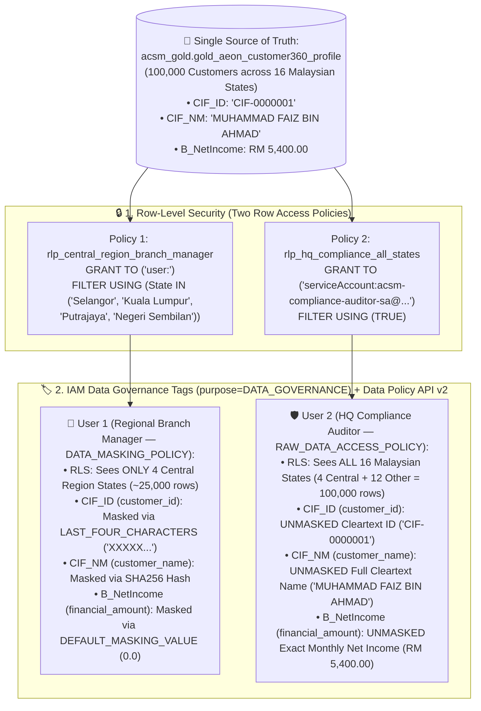

# Track 1 (Notebook 03) Walkthrough: Fine-Grained Data Governance — RLS, IAM Data Governance Tags (CLS), Dynamic Data Masking & Business Glossary

**Notebook**: [`03_Governance_Security_and_Data_Quality.ipynb`](../notebook/03_Governance_Security_and_Data_Quality.ipynb)
**Parked Modules Notebook (Can be discarded at end)**: [`03b_Parked_Dataplex_DLP_and_Data_Quality.ipynb`](../notebook/03b_Parked_Dataplex_DLP_and_Data_Quality.ipynb)
**SQL Script**: [`03_bnm_rmit_pdpa_security.sql`](../sql/03_bnm_rmit_pdpa_security.sql)
**Identity & CLS Provisioning Helpers**: [`setup_rls_cls_identities.py`](../scripts/setup_rls_cls_identities.py), [`setup_cls_data_governance_tags.py`](../scripts/setup_cls_data_governance_tags.py)
**Target Region**: `asia-southeast1` (Singapore)
**ACSM RFP Clauses**: `C1.1.1.24`, `C1.1.5.3`, `C1.1.5.5`, `C1.1.2.2`, `C1.1.1.8`, `C1.1.1.10`

---

## 1. Executive Summary & Two-Identity Verification Architecture

Notebook 03 demonstrates **Row-Level Security (RLS)**, **Column-Level Security (CLS)**, and **Dynamic Data Masking** directly on the physical Gold Customer 360 table (`acsm_gold.gold_aeon_customer360_profile`) using **BigQuery Row Access Policies**, **Cloud Resource Manager IAM Data Governance Tags (`purpose=DATA_GOVERNANCE`)**, and **BigQuery Data Policy API v2**, aligned with **Bank Negara Malaysia (BNM) RMiT** and **Malaysian PDPA 2010**.

To prove that BigQuery returns different results from the **exact same SQL query on the physical table** depending on who executes the query, **Step 0** automatically configures **two distinct governance identities**:
1. **👤 User 1 — Regional Branch Manager (Restricted Analyst)**: `user:<USER_EMAIL>` (your active logged-in workshop user, executed via `%%bigquery`)
2. **🛡️ User 2 — Head Office Compliance & Risk Auditor (Full Access)**: `serviceAccount:acsm-compliance-auditor-sa@<PROJECT_ID>.iam.gserviceaccount.com` (auto-provisioned in Step 0 and executed via `%%bigquery_as_sa`)




---

## 2. Step-by-Step Governance Walkthrough

| Step | Notebook Cell Magic | Identity Running Query | What Happens & What You Observe |
| :--- | :--- | :--- | :--- |
| **Step 0** | Python (`%run setup_rls_cls_identities.py`) | Admin Setup | Auto-detects `PROJECT_ID`, clears any prior Row Access Policies and Column Data Governance Tags, provisions **User 2** (`serviceAccount:acsm-compliance-auditor-sa@<PROJECT_ID>.iam.gserviceaccount.com`), and registers the `%%bigquery_as_sa` SQL magic. |
| **Step 1.1** | `%%bigquery` | **User 1 (`user:<USER_EMAIL>`)** | **Baseline Inspection (Before Security Policies)**: Queries `acsm_gold.gold_aeon_customer360_profile` showing **`100,000` visible customers across all `16` Malaysian states**, with raw unmasked `CIF_ID`, `CIF_NM`, and exact `B_NetIncome`. |
| **Step 1.2a** | `%%bigquery` | Policy DDL | **Apply Both Row-Level Security (RLS) Policies (`CREATE OR REPLACE ROW ACCESS POLICY`)**:<br>1. `rlp_central_region_branch_manager` $\rightarrow$ granted to **User 1 (`user:<USER_EMAIL>`)**, filtering `State IN ('Selangor', 'Kuala Lumpur', 'Putrajaya', 'Negeri Sembilan')`.<br>2. `rlp_hq_compliance_all_states` $\rightarrow$ granted to **User 2 (`serviceAccount:acsm-compliance-auditor-sa@<PROJECT_ID>.iam.gserviceaccount.com`)**, filtering `TRUE` (all 16 states). |
| **Step 1.2b** | `%%bigquery` | **👤 User 1 (`user:<USER_EMAIL>`)** | **Verify RLS as User 1 (Restricted Regional Manager)**: Runs `SELECT State, COUNT(*) ... FROM acsm_gold.gold_aeon_customer360_profile GROUP BY State` with **no `WHERE` clause** — returns **ONLY 4 rows** (`Selangor`, `Kuala Lumpur`, `Putrajaya`, `Negeri Sembilan` — `~25,000` customers). All 12 other Malaysian states are filtered out! |
| **Step 1.2c** | `%%bigquery_as_sa` | **🛡️ User 2 (`acsm-compliance-auditor-sa`)** | **Verify RLS as User 2 (HQ Compliance Auditor) Running the Exact Same Query**: Runs the **exact same `SELECT State, COUNT(*) ...` query** as `acsm-compliance-auditor-sa@<PROJECT_ID>.iam.gserviceaccount.com` — returns **ALL 16 Malaysian states** (the 4 Central Region states **PLUS all 12 other Malaysian states** = `100,000` customers)! |
| **Step 1.3a** | Python (`setup_cls_data_governance_tags.py`) | Tag & Data Policy API v2 | **Provision IAM Data Governance Tags & BigQuery Data Policies v2**:<br>• Creates Cloud Resource Manager Tag Key `<PROJECT_ID>/pii_classification` (`purpose=DATA_GOVERNANCE`) and **4 Tag Values** (`customer_name`, `customer_id`, `financial_amount`, `credit_bureau_score`).<br>• Creates `RAW_DATA_ACCESS_POLICY` v2 granting **User 2** unmasked access across all 4 tags.<br>• Creates `DATA_MASKING_POLICY` v2 (`SHA256`, `LAST_FOUR_CHARACTERS`, `DEFAULT_MASKING_VALUE`) granting **User 1** masked access on `customer_name`, `customer_id`, and `financial_amount`, while granting **NO policy** on `credit_bureau_score` (`latest_ctos_score`) so **User 1** is strictly blocked (`403 Access Denied`) from querying `latest_ctos_score`! |
| **Step 1.3b** | `%%bigquery` | Column Tag DDL + Audit | **Attach IAM Data Governance Tags via Pure BigQuery SQL DDL (`ALTER TABLE ... ALTER COLUMN ... SET OPTIONS (data_governance_tags=[...])`)**: Attaches tags directly to `CIF_NM`, `CIF_ID`, `B_NetIncome`, and `latest_ctos_score` on `acsm_gold.gold_aeon_customer360_profile` and verifies them via `acsm_gold.INFORMATION_SCHEMA.COLUMNS`. |
| **Step 1.3c** | `%%bigquery_expect_access_denied` | **👤 User 1 (`user:<USER_EMAIL>`)** | **Verify Strict Column Access Denial (`403 Access Denied`) as User 1**: User 1 attempts to query `latest_ctos_score` (`SELECT ..., latest_ctos_score FROM acsm_gold.gold_aeon_customer360_profile`). Because `credit_bureau_score` has no policy for User 1, BigQuery **blocks the query with `403 Access Denied`** (`User does not have masked access or raw data access to data governance tag protected columns`)! |
| **Step 1.3d** | `%%bigquery` | **👤 User 1 (`user:<USER_EMAIL>`)** | **Verify CLS Dynamic Data Masking + RLS as User 1 (Omitting `latest_ctos_score`)**: User 1 omits the prohibited `latest_ctos_score` column and queries `acsm_gold.gold_aeon_customer360_profile` — returns **only 4 Central Region states**, **`CIF_ID` masked via `LAST_FOUR_CHARACTERS` (`'XXXXX...'`)**, **`CIF_NM` masked via `SHA256` hash**, and **`B_NetIncome` masked via `DEFAULT_MASKING_VALUE` (`0.0`)**. |
| **Step 1.3e** | `%%bigquery_as_sa` | **🛡️ User 2 (`acsm-compliance-auditor-sa`)** | **Verify Full Unmasked CLS + RLS Including `latest_ctos_score` as User 2 (HQ Compliance Auditor)**: Runs the query **including `latest_ctos_score`, `CIF_ID`, `CIF_NM`, and `B_NetIncome`** as `acsm-compliance-auditor-sa@<PROJECT_ID>.iam.gserviceaccount.com` — returns **all 16 Malaysian states**, **unmasked `latest_ctos_score`**, **unmasked `CIF_ID`**, **unmasked `CIF_NM`**, and **unmasked `B_NetIncome`**! |
| **Step 1.4** | `%%bigquery` | Policy & Tag Reset | **1-Click Pure SQL Security Reset (`DROP ALL ROW ACCESS POLICIES` + `ALTER COLUMN ... SET OPTIONS (data_governance_tags=[])`)**: Removes both Row Access Policies and all 4 Column Data Governance Tags on `acsm_gold.gold_aeon_customer360_profile`, restoring all **`100,000` unmasked customers across all `16` Malaysian states** for downstream Notebooks 04–05 and Tracks 2–4. |
| **Step 1.5a** | Python (`sync_business_glossary.py`) | Catalog Sync | Reads [`business_glossary_acsm.yaml` ↗](https://github.com/arvind-dhariwal/aeon-credit-gcp-workshop/blob/main/track1_platform_governance/scripts/business_glossary_acsm.yaml), provisions/updates the Dataplex Business Glossary (`acsm-enterprise-credit-glossary`), 4 Categories, and 10 Terms in `asia-southeast1`, and materializes `acsm_gold.business_glossary_catalog`. |
| **Step 1.5b** | `%%bigquery` | **User 1 (`user:<USER_EMAIL>`)** | Queries all **10 standardized ACSM business terms**, their categories, synonyms, linked BigQuery columns, and assigned data stewards in pure BigQuery SQL. |

---

### 2.1 Deep-Dive: How to Validate Row-Level Security (RLS) with Both Users (`Step 1.2a` – `Step 1.2c`)

#### A. Two Row Access Policies Created in `Step 1.2a`
```sql
-- Policy 1: Restrict User 1 (Logged-in Regional Branch Manager) to ONLY the 4 Central Region states
EXECUTE IMMEDIATE FORMAT("""
  CREATE OR REPLACE ROW ACCESS POLICY rlp_central_region_branch_manager
  ON `acsm_gold.gold_aeon_customer360_profile`
  GRANT TO ('%s:%s')
  FILTER USING (State IN ('Selangor', 'Kuala Lumpur', 'Putrajaya', 'Negeri Sembilan'))
""", IF(ENDS_WITH(SESSION_USER(), '.gserviceaccount.com'), 'serviceAccount', 'user'), SESSION_USER());

-- Policy 2: Grant User 2 (HQ Compliance Auditor SA) visibility across ALL 16 Malaysian states
EXECUTE IMMEDIATE FORMAT("""
  CREATE OR REPLACE ROW ACCESS POLICY rlp_hq_compliance_all_states
  ON `acsm_gold.gold_aeon_customer360_profile`
  GRANT TO ('serviceAccount:acsm-compliance-auditor-sa@%s.iam.gserviceaccount.com')
  FILTER USING (TRUE)
""", @@project_id);
```

#### B. Exact Same RLS Validation Query Run by Both Users (`Step 1.2b` vs `Step 1.2c`)
Both **Step 1.2b** (`%%bigquery` as **User 1: `user:<USER_EMAIL>`**) and **Step 1.2c** (`%%bigquery_as_sa` as **User 2: `serviceAccount:acsm-compliance-auditor-sa@<PROJECT_ID>.iam.gserviceaccount.com`**) execute this **exact same SQL query**:
```sql
SELECT
  SESSION_USER() AS queried_by_user,
  COUNT(DISTINCT State) OVER () AS total_visible_states,
  SUM(COUNT(*)) OVER () AS total_visible_customers_across_states,
  State AS visible_malaysian_state,
  COUNT(*) AS visible_customers,
  ROUND(AVG(B_AnnualIncome), 2) AS avg_annual_income_rm,
  ROUND(AVG(avg_ep_dsr), 2) AS avg_dsr_pct
FROM `acsm_gold.gold_aeon_customer360_profile`
GROUP BY State
ORDER BY visible_customers DESC;
```

#### C. Side-by-Side Comparison of RLS Query Results
| Dimension | 👤 Step 1.2b Result — User 1 (`user:<USER_EMAIL>`) | 🛡️ Step 1.2c Result — User 2 (`acsm-compliance-auditor-sa@<PROJECT_ID>.iam.gserviceaccount.com`) |
| :--- | :--- | :--- |
| **Active RLS Policy** | `rlp_central_region_branch_manager` | `rlp_hq_compliance_all_states` |
| **Row Filter Condition** | `State IN ('Selangor', 'Kuala Lumpur', 'Putrajaya', 'Negeri Sembilan')` | `TRUE` (Unrestricted — all states) |
| **`total_visible_states`** | **`4` Malaysian States** | **`16` Malaysian States** (4 Central + **12 Other Malaysian States**) |
| **`total_visible_customers_across_states`** | **`~25,000` Customers** | **`100,000` Customers** |
| **Visible States Returned** | `Selangor`, `Kuala Lumpur`, `Putrajaya`, `Negeri Sembilan` *(12 other states hidden)* | `Selangor`, `Kuala Lumpur`, `Putrajaya`, `Negeri Sembilan` **PLUS** `Johor`, `Penang`, `Perak`, `Kedah`, `Kelantan`, `Melaka`, `Pahang`, `Perlis`, `Sabah`, `Sarawak`, `Terengganu`, `Labuan` |

---

### 2.2 Deep-Dive: How to Validate Column-Level Security (CLS) — Strict `403 Access Denied` & Dynamic Data Masking with IAM Data Governance Tags (`Step 1.3a` – `Step 1.3e`)

#### Why IAM Data Governance Tags (`purpose=DATA_GOVERNANCE`) Over Legacy Policy Tags / SQL Views ([Google Cloud Blog Reference](https://cloud.google.com/blog/products/data-analytics/level-up-your-column-level-security-using-iam-data-governance-tags-in-bigquery))
1. **Global Scope, Regional Enforcement**: Unlike legacy policy tags (which are regional-only), IAM Data Governance Tags (`<PROJECT_ID>/pii_classification`) are global resources in Cloud Resource Manager (`--purpose=DATA_GOVERNANCE`), while BigQuery Data Policies (`RAW_DATA_ACCESS_POLICY`, `DATA_MASKING_POLICY`) are enforced regionally (`asia-southeast1`).
2. **Managed Disaster Recovery**: Data governance tags and their associated data policies are automatically replicated to secondary regions during failover.
3. **Hierarchical Security (Up to 5 Levels Deep)**: Supports hierarchical tag value trees up to 5 levels deep (e.g., `pii -> private -> email`) for granular classification and inheritance.
4. **Decoupled Governance & Zero SQL Wrapper Views**: Sensitive columns on `acsm_gold.gold_aeon_customer360_profile` are tagged directly in place via `ALTER TABLE ... ALTER COLUMN ... SET OPTIONS (data_governance_tags=[...])` (or via `bq update --schema=schema.json` using `dataGovernanceTagsInfo.dataGovernanceTags`) — **no separate `_masked` SQL view required!** Access control activates once a `DATA_MASKING_POLICY` or `RAW_DATA_ACCESS_POLICY` is defined for that tag.

#### A. Attach All 4 IAM Data Governance Tags Directly to Columns via SQL DDL (`Step 1.3b`)
After `Step 1.3a` (`setup_cls_data_governance_tags.py`) provisions the Cloud Resource Manager Tag Key (`<PROJECT_ID>/pii_classification` with `purpose=DATA_GOVERNANCE`), the 4 Tag Values (`customer_name`, `customer_id`, `financial_amount`, `credit_bureau_score`), and the BigQuery Data Policies v2 (`RAW_DATA_ACCESS_POLICY` for User 2 across all 4 tags; `DATA_MASKING_POLICY` for User 1 on 3 tags; and **NO policy for User 1** on `credit_bureau_score`), `Step 1.3b` attaches the tags directly to the physical table columns in pure SQL and verifies them via `INFORMATION_SCHEMA.COLUMNS`:
```sql
EXECUTE IMMEDIATE FORMAT("""
  ALTER TABLE `acsm_gold.gold_aeon_customer360_profile`
  ALTER COLUMN CIF_NM
  SET OPTIONS (data_governance_tags=[('%s/pii_classification', 'customer_name')])
""", @@project_id);

EXECUTE IMMEDIATE FORMAT("""
  ALTER TABLE `acsm_gold.gold_aeon_customer360_profile`
  ALTER COLUMN CIF_ID
  SET OPTIONS (data_governance_tags=[('%s/pii_classification', 'customer_id')])
""", @@project_id);

EXECUTE IMMEDIATE FORMAT("""
  ALTER TABLE `acsm_gold.gold_aeon_customer360_profile`
  ALTER COLUMN B_NetIncome
  SET OPTIONS (data_governance_tags=[('%s/pii_classification', 'financial_amount')])
""", @@project_id);

EXECUTE IMMEDIATE FORMAT("""
  ALTER TABLE `acsm_gold.gold_aeon_customer360_profile`
  ALTER COLUMN latest_ctos_score
  SET OPTIONS (data_governance_tags=[('%s/pii_classification', 'credit_bureau_score')])
""", @@project_id);

SELECT
  table_schema AS dataset_id,
  table_name,
  column_name,
  data_type,
  data_governance_tags[SAFE_OFFSET(0)].key AS tag_key,
  data_governance_tags[SAFE_OFFSET(0)].value AS tag_value
FROM `acsm_gold.INFORMATION_SCHEMA.COLUMNS`
WHERE table_name = 'gold_aeon_customer360_profile'
  AND ARRAY_LENGTH(data_governance_tags) > 0
ORDER BY column_name;
```

#### B. Test All 3 CLS Enforcement Modes (`Step 1.3c`, `Step 1.3d`, `Step 1.3e`)
1. **🚫 Mode 1 — Strict Column Access Denial (`Step 1.3c` as 👤 User 1)**:
   When **👤 User 1** attempts to query `latest_ctos_score` (`SELECT SESSION_USER() AS queried_by_user, CIF_ID, CIF_NM, State, B_NetIncome, latest_ctos_score FROM acsm_gold.gold_aeon_customer360_profile LIMIT 5`), BigQuery **blocks the query with HTTP `403 Access Denied`** (`User does not have masked access or raw data access to data governance tag protected columns`)!
2. **🎭 Mode 2 — Dynamic Data Masking (`Step 1.3d` as 👤 User 1, Omitting `latest_ctos_score`)**:
   When **👤 User 1** omits `latest_ctos_score` (or uses `SELECT * EXCEPT(latest_ctos_score)`), the query succeeds and returns masked `CIF_ID` (`XXXXX0001`), masked `CIF_NM` (`SHA256`), and masked `B_NetIncome` (`0.0`) for the 4 Central Region states.
3. **🛡️ Mode 3 — Full Unmasked Raw Access (`Step 1.3e` as 🛡️ User 2, Including `latest_ctos_score`)**:
   When **🛡️ User 2 (`acsm-compliance-auditor-sa@...`)** runs the query **including `latest_ctos_score`, `CIF_ID`, `CIF_NM`, and `B_NetIncome`**, the query succeeds across all 16 Malaysian states and returns all 4 protected columns in full unmasked cleartext!

#### C. Side-by-Side Comparison of CLS + RLS Query Results
| Output Column | IAM Data Governance Tag | 👤 User 1 (`user:<USER_EMAIL>`) — `Step 1.3c` / `Step 1.3d` | 🛡️ User 2 (`acsm-compliance-auditor-sa@...`) — `Step 1.3e` (`RAW_DATA_ACCESS_POLICY`) |
| :--- | :--- | :--- | :--- |
| **`queried_by_user`** | *(Session Identity)* | `<USER_EMAIL>` | `acsm-compliance-auditor-sa@<PROJECT_ID>.iam.gserviceaccount.com` |
| **`State` (RLS)** | `ROW ACCESS POLICY` | **ONLY 4 Central Region States** (`Selangor`, `Kuala Lumpur`, `Putrajaya`, `Negeri Sembilan`) | **All 16 Malaysian States** (`Johor`, `Penang`, `Sabah`, `Sarawak`, `Selangor`, etc.) |
| **`latest_ctos_score` (CLS)** | `credit_bureau_score` (**Restricted**) | **🚫 `403 ACCESS DENIED` in `Step 1.3c` (Cannot query column at all!)** | **UNMASKED CTOS Bureau Score (`745`, `680`)** |
| **`CIF_ID` (CLS)** | `customer_id` (`LAST_FOUR_CHARACTERS`) | **MASKED (`'XXXXX0001'`)** in `Step 1.3d` | **UNMASKED Cleartext (`'CIF-0000001'`)** |
| **`CIF_NM` (CLS)** | `customer_name` (`SHA256`) | **MASKED (`SHA256` cryptographic hash)** in `Step 1.3d` | **UNMASKED Cleartext (`'MUHAMMAD FAIZ BIN AHMAD'`)** |
| **`B_NetIncome` (CLS)** | `financial_amount` (`DEFAULT_MASKING_VALUE`) | **MASKED to `0.0`** in `Step 1.3d` | **UNMASKED Exact Monthly Net Income (`5400.00`, `8250.00` MYR)** |

---

## 3. Dataplex Business Glossary Design & Walkthrough Plan (`RFP C1.1.1.8` & `C1.1.1.10`)

In Google Cloud **Dataplex Universal Catalog (Knowledge Catalog)**, a **Business Glossary** bridges technical column names (`CIF_ID`, `B_NetIncome`, `avg_ep_dsr`, `ep_unpaid_osp`) and standardized AEON Credit business definitions. Furthermore, **BigQuery Conversational Analytics (BQCA) Data Agents automatically import up to 10 attached Business Glossary terms per table** to resolve domain acronyms during natural-language SQL generation.

### 3.1 Declarative YAML Config & Top-Level Glossary Resource
- **Declarative YAML File**: [`track1_platform_governance/scripts/business_glossary_acsm.yaml`](../scripts/business_glossary_acsm.yaml) ([View on GitHub ↗](https://github.com/arvind-dhariwal/aeon-credit-gcp-workshop/blob/main/track1_platform_governance/scripts/business_glossary_acsm.yaml))
- **Glossary ID**: `acsm-enterprise-credit-glossary`
- **Display Name**: `ACSM Enterprise Consumer Finance & Regulatory Glossary`
- **Region**: `asia-southeast1` (Singapore)
- **Direct Glossary Deep Link (Auto-rendered with `PROJECT_ID` in Notebook `Step 1.5a` output)**:
  `https://console.cloud.google.com/dataplex/dp-glossaries/projects/<PROJECT_ID>/locations/asia-southeast1/glossaries/acsm-enterprise-credit-glossary?project=<PROJECT_ID>`
- **All Glossaries Console Link**: [`https://console.cloud.google.com/dataplex/dp-glossaries`](https://console.cloud.google.com/dataplex/dp-glossaries) (or **BigQuery $\rightarrow$ Governance $\rightarrow$ Business Glossary**)

### 3.2 Recommended 4 Categories & 10 Standardized ACSM Business Terms

| Category (`Category ID`) | Business Term (`Term ID`) | Standardized Business Definition | Synonyms & Related Terms | Linked BigQuery Columns (`Schema.<COLUMN>`) |
| :--- | :--- | :--- | :--- | :--- |
| **1. Customer Identity & PDPA Consent**<br>(`customer-identity-pdpa`) | **Customer Information File ID**<br>(`cif-id`) | Unique master customer identifier assigned by ACSM's core Customer Information File (`m3CIF`) across Easy Payment (`EP`), Credit Card (`CC`), and Personal Financing (`PF`) lines. | **Synonym**: `Master Customer Number`<br>**Related**: `PDPA Marketing Consent Flag` | • `acsm_gold.gold_aeon_customer360_profile.CIF_ID`<br>• `acsm_bronze.m3CIF.CIF_ID` |
| **1. Customer Identity & PDPA Consent**<br>(`customer-identity-pdpa`) | **BNM Household Income Tier (B40 / M40 / T20)**<br>(`bnm-household-income-tier`) | Standardized Malaysian household income classification based on monthly net income (`B_NetIncome`): **B40** (`< RM 3,000`), **M40** (`RM 3,000 – RM 7,000`), and **T20** (`> RM 7,000`). Used for BNM reporting and PDPA dynamic income masking. | **Related**: `Net Disposable Income (NDI)`, `Debt Service Ratio (DSR %)` | • `acsm_gold.gold_aeon_customer360_profile.B_NetIncome`<br>• `acsm_bronze.m3CIF.B_NetIncome` |
| **1. Customer Identity & PDPA Consent**<br>(`customer-identity-pdpa`) | **PDPA Marketing Consent Flag**<br>(`pdpa-marketing-consent`) | Explicit customer opt-in indicator (`RecvPromo_FG = 'Y'`) required under Malaysian PDPA 2010 before targeting a customer with cross-sell or promotional campaigns. | **Related**: `Customer Information File ID` | • `acsm_gold.gold_aeon_customer360_profile.RecvPromo_FG`<br>• `acsm_bronze.m3CIF.RecvPromo_FG` |
| **2. Credit Underwriting & BNM Regulatory Metrics**<br>(`underwriting-bnm-credit-risk`) | **Debt Service Ratio (DSR %)**<br>(`debt-service-ratio-dsr`) | Ratio of total monthly debt obligations (ACSM + CCRIS) to monthly net income (`DSR %`). Under BNM Responsible Financing Guidelines, `DSR > 60%` requires enhanced underwriting review and `DSR > 100%` is quarantined by AutoDQ. | **Synonym**: `Monthly Debt Burden Ratio`<br>**Related**: `Net Disposable Income (NDI)`, `CTOS External Credit Bureau Score` | • `acsm_gold.gold_aeon_customer360_profile.avg_ep_dsr`<br>• `acsm_bronze.Fact_EP_Judge.DSR` |
| **2. Credit Underwriting & BNM Regulatory Metrics**<br>(`underwriting-bnm-credit-risk`) | **Net Disposable Income (NDI MYR)**<br>(`net-disposable-income-ndi`) | Remaining monthly income in Malaysian Ringgit (`MYR`) after deducting statutory contributions, existing financing instalments, and minimum living expenditure buffers. | **Related**: `Debt Service Ratio (DSR %)`, `BNM Household Income Tier` | • `acsm_gold.gold_aeon_customer360_profile.avg_ep_ndi`<br>• `acsm_bronze.Fact_EP_Judge.NDI` |
| **2. Credit Underwriting & BNM Regulatory Metrics**<br>(`underwriting-bnm-credit-risk`) | **CTOS External Credit Bureau Score**<br>(`ctos-bureau-score`) | 3-digit external credit bureau score (`100–999`) from CTOS Data Systems Malaysia (`CTOS_Score`) measuring historical repayment behavior and creditworthiness at underwriting. | **Related**: `Debt Service Ratio (DSR %)` | • `acsm_gold.gold_aeon_customer360_profile.avg_ep_ctos_score`<br>• `acsm_gold.gold_aeon_customer360_profile.avg_cc_ctos_score` |
| **3. Collections, Delinquency & AKPK Restructuring**<br>(`collections-delinquency-recovery`) | **Unpaid Outstanding Principal (OSP MYR)**<br>(`unpaid-osp`) | Total unpaid principal balance (`Unpaid_OSP` in `MYR`) currently overdue on delinquent Easy Payment or Credit Card accounts tracked by ACSM Credit Control. | **Synonym**: `Delinquent Principal Exposure`<br>**Related**: `Months In Arrears (MIA)` | • `acsm_gold.gold_aeon_customer360_profile.ep_unpaid_osp`<br>• `acsm_bronze.Fact_EP_Collection.Unpaid_OSP` |
| **3. Collections, Delinquency & AKPK Restructuring**<br>(`collections-delinquency-recovery`) | **Months In Arrears (MIA / `Od_Stage`)**<br>(`months-in-arrears-mia`) | Delinquency aging bucket (`M0 Current`, `M1: 1–30 DPD`, `M2: 31–60 DPD`, `M3: 61–90 DPD`, `M4+: 90+ DPD Non-Performing`) governing collection dialer queues and MFRS 9 impairment staging. | **Synonym**: `Overdue Stage`<br>**Related**: `Unpaid Outstanding Principal (OSP)` | • `acsm_gold.gold_aeon_customer360_profile.max_ep_overdue_stage`<br>• `acsm_bronze.Fact_EP_Collection.Od_Stage` |
| **3. Collections, Delinquency & AKPK Restructuring**<br>(`collections-delinquency-recovery`) | **AKPK Debt Restructuring Indicator**<br>(`akpk-debt-management-flag`) | Flag (`AKPK_FG`) identifying customers enrolled in *Agensi Kaunseling dan Pengurusan Kredit (AKPK)* Debt Management Programme, requiring collection call suppression and BNM fair-treatment compliance. | **Related**: `Months In Arrears (MIA)` | • `acsm_bronze.Fact_EP_Collection.AKPK_FG`<br>• `acsm_bronze.Fact_CC_Collection.AKPK_FG` |
| **4. Consumer Finance Products & Portfolio Utilization**<br>(`product-portfolio-cross-sell`) | **Revolving Credit Card Utilization Ratio**<br>(`revolving-credit-utilization`) | Ratio of current Credit Card balance to approved Credit Card limit (`CP_CL_Usage / CP_CL`). High utilization (`> 80%`) drives both delinquency risk and Personal Financing consolidation cross-sell models. | **Related**: `Debt Service Ratio (DSR %)`, `Unpaid Outstanding Principal (OSP)` | • `acsm_gold.gold_aeon_customer360_profile.avg_cc_utilization_ratio`<br>• `acsm_bronze.Fact_CC_Sales.CP_CL_Usage` |

### 3.3 Live Demo Walkthrough Steps (`10–12 Mins`)
1. **Create / Inspect the Glossary (`3 Mins`)**: Open **Knowledge Catalog $\rightarrow$ Glossaries** (`https://console.cloud.google.com/dataplex/dp-glossaries`), expand `ACSM Enterprise Consumer Finance & Regulatory Glossary` (`asia-southeast1`), and walk through the 4 categories and 10 business terms.
2. **Attach Terms to Physical BigQuery Columns (`3 Mins`)**: Open `acsm_gold.gold_aeon_customer360_profile` $\rightarrow$ **Schema** tab, select `avg_ep_dsr`, `ep_unpaid_osp`, and `B_NetIncome`, and click **Add business term** to attach **`Debt Service Ratio (DSR %)`**, **`Unpaid Outstanding Principal (OSP MYR)`**, and **`BNM Household Income Tier (B40 / M40 / T20)`**.
3. **Demonstrate Semantic Search by Business Concept (`2 Mins`)**: Search `"Delinquent Principal Exposure"` or `"Debt Service Ratio"` in **Knowledge Catalog Search** (`https://console.cloud.google.com/dataplex/dp-search`) and show how `acsm_gold.gold_aeon_customer360_profile` surfaces immediately via its attached glossary term even though the physical columns are named `ep_unpaid_osp` and `avg_ep_dsr`.
4. **Connect Glossary to IAM Data Governance Tag CLS Masking & Conversational Analytics (`3 Mins`)**: Show how Category 1 terms (`Customer Information File ID` & `BNM Household Income Tier`) align with the IAM Data Governance Tag (`<PROJECT_ID>/pii_classification`) dynamic masking policies in **Step 1.3** on `acsm_gold.gold_aeon_customer360_profile`, and how the 10 attached terms are automatically ingested by **BigQuery Conversational Analytics (`BQCA`)** in Track 1 Notebook 05 and Track 3.
