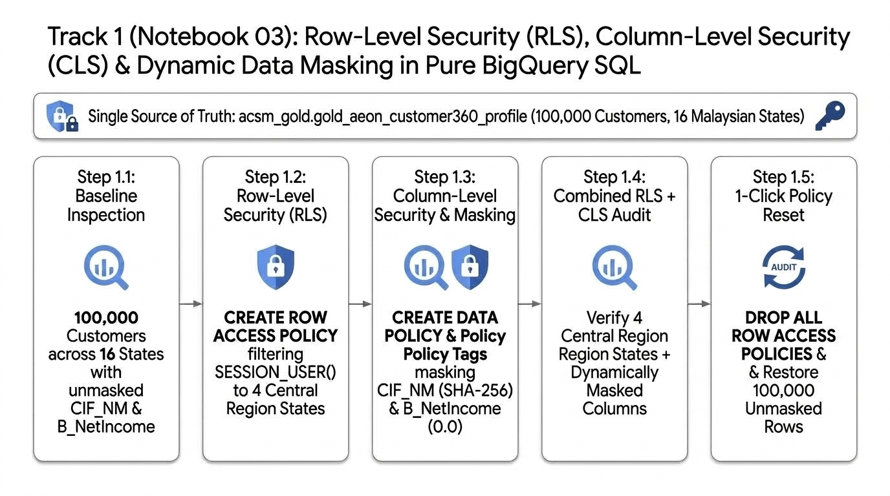
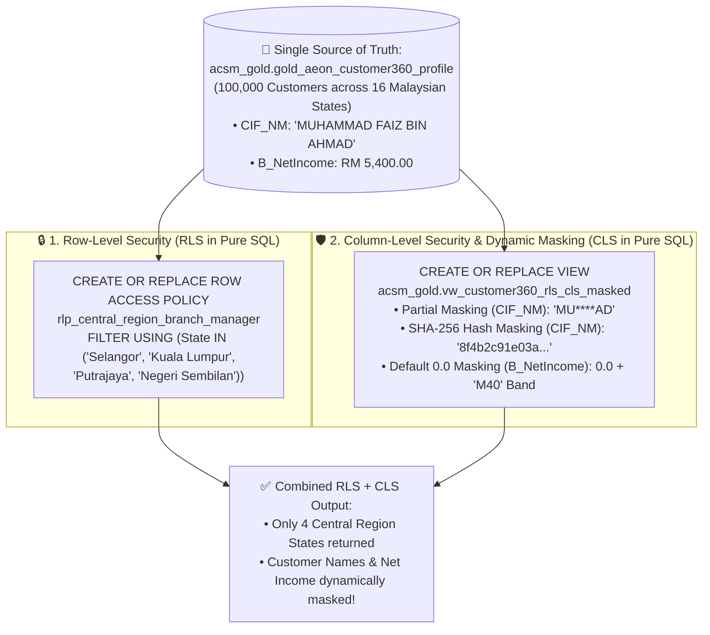

# Track 1 (Notebook 03) Walkthrough: Fine-Grained Data Governance — RLS, CLS & Dynamic Data Masking in Pure BigQuery SQL

**Notebook**: [`03_Governance_Security_and_Data_Quality.ipynb`](../notebook/03_Governance_Security_and_Data_Quality.ipynb)
**Parked Modules Notebook (Can be discarded at end)**: [`03b_Parked_Dataplex_DLP_and_Data_Quality.ipynb`](../notebook/03b_Parked_Dataplex_DLP_and_Data_Quality.ipynb)
**SQL Script**: [`03_bnm_rmit_pdpa_security.sql`](../sql/03_bnm_rmit_pdpa_security.sql)
**Target Region**: `asia-southeast1` (Singapore)
**ACSM RFP Clauses**: `C1.1.1.24`, `C1.1.5.3`, `C1.1.5.5`, `C1.1.2.2`

---

## 1. Executive Summary & Visual Architecture

Notebook 03 demonstrates **Row-Level Security (RLS)**, **Column-Level Security (CLS)**, and **Dynamic Data Masking** **100% purely in BigQuery SQL (`%%bigquery`)** on the single Gold Customer 360 table (`acsm_gold.gold_aeon_customer360_profile`), aligned with **Bank Negara Malaysia (BNM) RMiT** and **Malaysian PDPA 2010**:

---

## 2. Step-by-Step Pure SQL Walkthrough

| Step | Pure BigQuery SQL (`%%bigquery`) | What Happens & What You Observe |
| :--- | :--- | :--- |
| **Step 0** | Environment Setup & Reset Check | Auto-detects `PROJECT_ID` in `asia-southeast1` and ensures no prior Row Access Policy is active before starting the baseline check. |
| **Step 1.1** | **Baseline Inspection (Before Security Policies)** | Queries `acsm_gold.gold_aeon_customer360_profile` showing **`100,000` visible customers across all `16` Malaysian states**, with raw unmasked customer names (`CIF_NM`) and exact monthly net income (`B_NetIncome`). |
| **Step 1.2a** | **Apply Row-Level Security (`CREATE OR REPLACE ROW ACCESS POLICY`)** | Uses `EXECUTE IMMEDIATE` with `SESSION_USER()` to create `rlp_central_region_branch_manager` on `acsm_gold.gold_aeon_customer360_profile` filtering `State IN ('Selangor', 'Kuala Lumpur', 'Putrajaya', 'Negeri Sembilan')`. |
| **Step 1.2b** | **Verify RLS Enforcement (`SELECT State, COUNT(*) ...`)** | Queries the exact same table (`acsm_gold.gold_aeon_customer360_profile`) with **no `WHERE` clause** — only the **4 Central Region states** (`Selangor`, `Kuala Lumpur`, `Putrajaya`, `Negeri Sembilan`) are returned; the other 12 Malaysian states are automatically filtered out! |
| **Step 1.3a** | **Apply Column-Level Security & Dynamic Data Masking (`CREATE OR REPLACE VIEW`)** | Creates `acsm_gold.vw_customer360_rls_cls_masked` implementing 3 pure-SQL masking patterns based on `SESSION_USER()`:\n1. **Partial Redaction (`CIF_NM`)**: `CONCAT(SUBSTR(CIF_NM, 1, 2), '****', SUBSTR(CIF_NM, -2))` (`MU****AD`)\n2. **Cryptographic SHA-256 Hash (`CIF_NM`)**: `TO_HEX(SHA256(CAST(CIF_NM AS STRING)))`\n3. **Default `0.0` Masking + BNM Income Banding (`B_NetIncome`)**: Masks exact net income to `0.0` while exposing `B40 (< RM 3,000)`, `M40 (RM 3,000 - RM 7,000)`, or `T20 (> RM 7,000)`. |
| **Step 1.3b** | **Verify Combined RLS + CLS Masking** | Queries `acsm_gold.vw_customer360_rls_cls_masked` and verifies that **both Row-Level Security (only 4 Central Region states) and Column-Level Masking (`MU****AD`, SHA-256 hash, `0.0` net income)** are enforced simultaneously. |
| **Step 1.4** | **1-Click Pure SQL Policy Reset (`DROP ALL ROW ACCESS POLICIES`)** | Drops the Row Access Policy on `acsm_gold.gold_aeon_customer360_profile` and verifies all **`100,000` customers across all `16` Malaysian states** are restored for downstream Notebooks 04–05 and Tracks 2–4. |
| **Step 1.5a** | **Sync `business_glossary_acsm.yaml` to Dataplex & BigQuery** | Reads [`business_glossary_acsm.yaml` ↗](https://github.com/arvind-dhariwal/aeon-credit-gcp-workshop/blob/main/track1_platform_governance/scripts/business_glossary_acsm.yaml), provisions/updates the Dataplex Business Glossary (`acsm-enterprise-credit-glossary`), 4 Categories, and 10 Terms in `asia-southeast1`, and materializes `acsm_gold.business_glossary_catalog`. |
| **Step 1.5b** | **Verify Synced Business Glossary (`SELECT * FROM acsm_gold.business_glossary_catalog`)** | Queries all **10 standardized ACSM business terms**, their categories, synonyms, linked BigQuery columns, and assigned data stewards in pure BigQuery SQL. |

---

## 3. Dataplex Business Glossary Design & Walkthrough Plan (`RFP C1.1.1.8` & `C1.1.1.10`)

In Google Cloud **Dataplex Universal Catalog (Knowledge Catalog)**, a **Business Glossary** bridges technical column names (`CIF_ID`, `B_NetIncome`, `avg_ep_dsr`, `ep_unpaid_osp`) and standardized AEON Credit business definitions. Furthermore, **BigQuery Conversational Analytics (BQCA) Data Agents automatically import up to 10 attached Business Glossary terms per table** to resolve domain acronyms during natural-language SQL generation.

### 3.1 Declarative YAML Config & Top-Level Glossary Resource
- **Declarative YAML File**: [`track1_platform_governance/scripts/business_glossary_acsm.yaml`](../scripts/business_glossary_acsm.yaml) ([View on GitHub ↗](https://github.com/arvind-dhariwal/aeon-credit-gcp-workshop/blob/main/track1_platform_governance/scripts/business_glossary_acsm.yaml))
- **Glossary ID**: `acsm-enterprise-credit-glossary`
- **Display Name**: `ACSM Enterprise Consumer Finance & Regulatory Glossary`
- **Region**: `asia-southeast1` (Singapore)
- **Console Link**: [`https://console.cloud.google.com/dataplex/dp-glossaries`](https://console.cloud.google.com/dataplex/dp-glossaries) (or **BigQuery $\rightarrow$ Governance $\rightarrow$ Business Glossary**)

### 3.2 Recommended 4 Categories & 10 Standardized ACSM Business Terms

| Category (`Category ID`) | Business Term (`Term ID`) | Standardized Business Definition | Synonyms & Related Terms | Linked BigQuery Columns (`Schema.<COLUMN>`) |
| :--- | :--- | :--- | :--- | :--- |
| **1. Customer Identity & PDPA Consent** (`customer-identity-pdpa`) | **Customer Information File ID** (`cif-id`) | Unique master customer identifier assigned by ACSM's core Customer Information File (`m3CIF`) across Easy Payment (`EP`), Credit Card (`CC`), and Personal Financing (`PF`) lines. | **Synonym**: `Master Customer Number` **Related**: `PDPA Marketing Consent Flag` | • `acsm_gold.gold_aeon_customer360_profile.CIF_ID` • `acsm_bronze.m3CIF.CIF_ID` |
| **1. Customer Identity & PDPA Consent** (`customer-identity-pdpa`) | **BNM Household Income Tier (B40 / M40 / T20)** (`bnm-household-income-tier`) | Standardized Malaysian household income classification based on monthly net income (`B_NetIncome`): **B40** (`< RM 3,000`), **M40** (`RM 3,000 – RM 7,000`), and **T20** (`> RM 7,000`). Used for BNM reporting and PDPA dynamic income masking. | **Related**: `Net Disposable Income (NDI)`, `Debt Service Ratio (DSR %)` | • `acsm_gold.gold_aeon_customer360_profile.B_NetIncome` • `acsm_gold.vw_customer360_rls_cls_masked.bnm_income_tier_band` |
| **1. Customer Identity & PDPA Consent** (`customer-identity-pdpa`) | **PDPA Marketing Consent Flag** (`pdpa-marketing-consent`) | Explicit customer opt-in indicator (`RecvPromo_FG = 'Y'`) required under Malaysian PDPA 2010 before targeting a customer with cross-sell or promotional campaigns. | **Related**: `Customer Information File ID` | • `acsm_gold.gold_aeon_customer360_profile.RecvPromo_FG` • `acsm_bronze.m3CIF.RecvPromo_FG` |
| **2. Credit Underwriting & BNM Regulatory Metrics** (`underwriting-bnm-credit-risk`) | **Debt Service Ratio (DSR %)** (`debt-service-ratio-dsr`) | Ratio of total monthly debt obligations (ACSM + CCRIS) to monthly net income (`DSR %`). Under BNM Responsible Financing Guidelines, `DSR > 60%` requires enhanced underwriting review and `DSR > 100%` is quarantined by AutoDQ. | **Synonym**: `Monthly Debt Burden Ratio` **Related**: `Net Disposable Income (NDI)`, `CTOS External Credit Bureau Score` | • `acsm_gold.gold_aeon_customer360_profile.avg_ep_dsr` • `acsm_bronze.Fact_EP_Judge.DSR` |
| **2. Credit Underwriting & BNM Regulatory Metrics** (`underwriting-bnm-credit-risk`) | **Net Disposable Income (NDI MYR)** (`net-disposable-income-ndi`) | Remaining monthly income in Malaysian Ringgit (`MYR`) after deducting statutory contributions, existing financing instalments, and minimum living expenditure buffers. | **Related**: `Debt Service Ratio (DSR %)`, `BNM Household Income Tier` | • `acsm_gold.gold_aeon_customer360_profile.avg_ep_ndi` • `acsm_bronze.Fact_EP_Judge.NDI` |
| **2. Credit Underwriting & BNM Regulatory Metrics** (`underwriting-bnm-credit-risk`) | **CTOS External Credit Bureau Score** (`ctos-bureau-score`) | 3-digit external credit bureau score (`100–999`) from CTOS Data Systems Malaysia (`CTOS_Score`) measuring historical repayment behavior and creditworthiness at underwriting. | **Related**: `Debt Service Ratio (DSR %)` | • `acsm_gold.gold_aeon_customer360_profile.avg_ep_ctos_score` • `acsm_gold.gold_aeon_customer360_profile.avg_cc_ctos_score` |
| **3. Collections, Delinquency & AKPK Restructuring** (`collections-delinquency-recovery`) | **Unpaid Outstanding Principal (OSP MYR)** (`unpaid-osp`) | Total unpaid principal balance (`Unpaid_OSP` in `MYR`) currently overdue on delinquent Easy Payment or Credit Card accounts tracked by ACSM Credit Control. | **Synonym**: `Delinquent Principal Exposure` **Related**: `Months In Arrears (MIA)` | • `acsm_gold.gold_aeon_customer360_profile.ep_unpaid_osp` • `acsm_bronze.Fact_EP_Collection.Unpaid_OSP` |
| **3. Collections, Delinquency & AKPK Restructuring** (`collections-delinquency-recovery`) | **Months In Arrears (MIA / `Od_Stage`)** (`months-in-arrears-mia`) | Delinquency aging bucket (`M0 Current`, `M1: 1–30 DPD`, `M2: 31–60 DPD`, `M3: 61–90 DPD`, `M4+: 90+ DPD Non-Performing`) governing collection dialer queues and MFRS 9 impairment staging. | **Synonym**: `Overdue Stage` **Related**: `Unpaid Outstanding Principal (OSP)` | • `acsm_gold.gold_aeon_customer360_profile.max_ep_overdue_stage` • `acsm_bronze.Fact_EP_Collection.Od_Stage` |
| **3. Collections, Delinquency & AKPK Restructuring** (`collections-delinquency-recovery`) | **AKPK Debt Restructuring Indicator** (`akpk-debt-management-flag`) | Flag (`AKPK_FG`) identifying customers enrolled in *Agensi Kaunseling dan Pengurusan Kredit (AKPK)* Debt Management Programme, requiring collection call suppression and BNM fair-treatment compliance. | **Related**: `Months In Arrears (MIA)` | • `acsm_bronze.Fact_EP_Collection.AKPK_FG` • `acsm_bronze.Fact_CC_Collection.AKPK_FG` |
| **4. Consumer Finance Products & Portfolio Utilization** (`product-portfolio-cross-sell`) | **Revolving Credit Card Utilization Ratio** (`revolving-credit-utilization`) | Ratio of current Credit Card balance to approved Credit Card limit (`CP_CL_Usage / CP_CL`). High utilization (`> 80%`) drives both delinquency risk and Personal Financing consolidation cross-sell models. | **Related**: `Debt Service Ratio (DSR %)`, `Unpaid Outstanding Principal (OSP)` | • `acsm_gold.gold_aeon_customer360_profile.avg_cc_utilization_ratio` • `acsm_bronze.Fact_CC_Sales.CP_CL_Usage` |

### 3.3 Live Demo Walkthrough Steps (`10–12 Mins`)
1. **Create / Inspect the Glossary (`3 Mins`)**: Open **Knowledge Catalog $\rightarrow$ Glossaries** (`https://console.cloud.google.com/dataplex/dp-glossaries`), expand `ACSM Enterprise Consumer Finance & Regulatory Glossary` (`asia-southeast1`), and walk through the 4 categories and 10 business terms.
2. **Attach Terms to Physical BigQuery Columns (`3 Mins`)**: Open `acsm_gold.gold_aeon_customer360_profile` $\rightarrow$ **Schema** tab, select `avg_ep_dsr`, `ep_unpaid_osp`, and `B_NetIncome`, and click **Add business term** to attach **`Debt Service Ratio (DSR %)`**, **`Unpaid Outstanding Principal (OSP MYR)`**, and **`BNM Household Income Tier (B40 / M40 / T20)`**.
3. **Demonstrate Semantic Search by Business Concept (`2 Mins`)**: Search `"Delinquent Principal Exposure"` or `"Debt Service Ratio"` in **Knowledge Catalog Search** (`https://console.cloud.google.com/dataplex/dp-search`) and show how `acsm_gold.gold_aeon_customer360_profile` surfaces immediately via its attached glossary term even though the physical columns are named `ep_unpaid_osp` and `avg_ep_dsr`.
4. **Connect Glossary to RLS/CLS Masking & Conversational Analytics (`3 Mins`)**: Show how Category 1 terms (`Customer Information File ID` & `BNM Household Income Tier`) govern the dynamic masking policies in **Step 1.3** (`vw_customer360_rls_cls_masked`), and how the 10 attached terms are automatically ingested by **BigQuery Conversational Analytics (`BQCA`)** in Track 1 Notebook 05 and Track 3.

