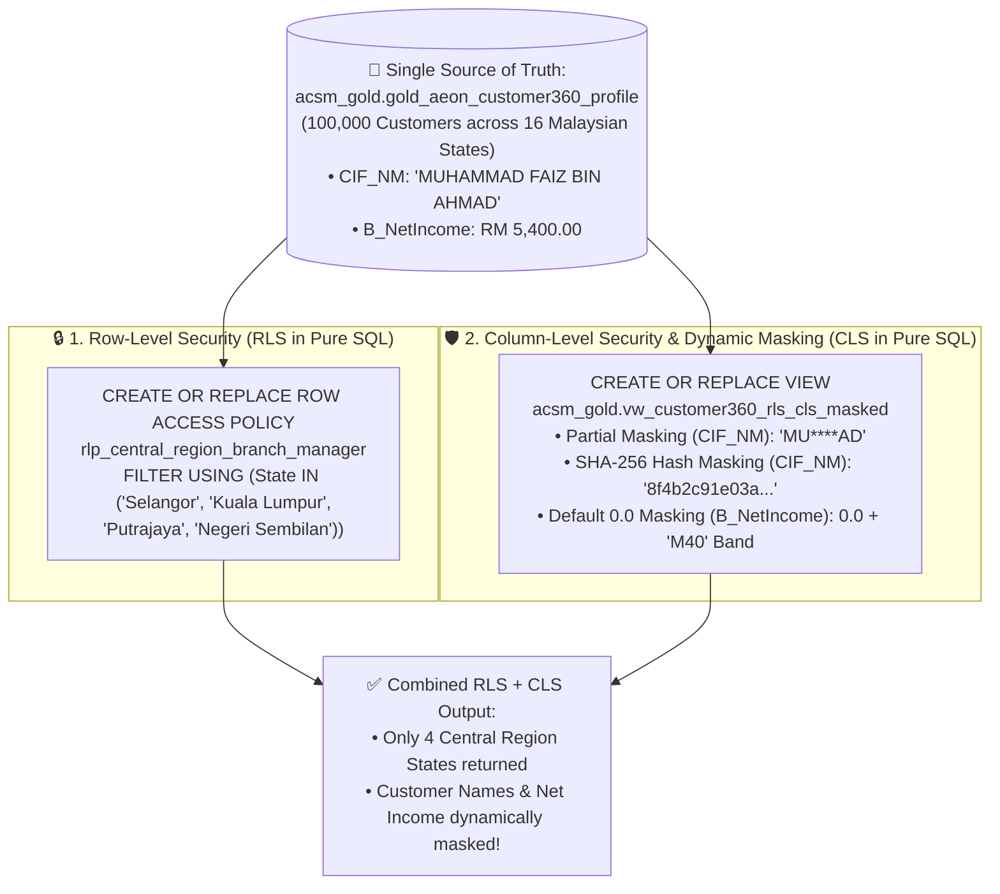

# Track 1 (Notebook 03) Walkthrough: Fine-Grained Data Governance — RLS, CLS & Dynamic Data Masking in Pure BigQuery SQL

**Notebook**: [`03_Governance_Security_and_Data_Quality.ipynb`](../notebook/03_Governance_Security_and_Data_Quality.ipynb)
**Parked Modules Notebook (Can be discarded at end)**: [`03b_Parked_Dataplex_DLP_and_Data_Quality.ipynb`](../notebook/03b_Parked_Dataplex_DLP_and_Data_Quality.ipynb)
**SQL Script**: [`03_bnm_rmit_pdpa_security.sql`](../sql/03_bnm_rmit_pdpa_security.sql)
**Target Region**: `asia-southeast1` (Singapore)
**ACSM RFP Clauses**: `C1.1.1.24`, `C1.1.5.3`, `C1.1.5.5`, `C1.1.2.2`

---

## 1. Executive Summary & Visual Architecture

Notebook 03 demonstrates **Row-Level Security (RLS)**, **Column-Level Security (CLS)**, and **Dynamic Data Masking** **100% purely in BigQuery SQL (`%%bigquery`)** on the single Gold Customer 360 table (`acsm_gold.gold_aeon_customer360_profile`), aligned with **Bank Negara Malaysia (BNM) RMiT** and **Malaysian PDPA 2010**:

---

## 2. Step-by-Step Pure SQL Walkthrough

| Step | Pure BigQuery SQL (`%%bigquery`) | What Happens & What You Observe |
| :--- | :--- | :--- |
| **Step 0** | Environment Setup & Reset Check | Auto-detects `PROJECT_ID` in `asia-southeast1` and ensures no prior Row Access Policy is active before starting the baseline check. |
| **Step 1.1** | **Baseline Inspection (Before Security Policies)** | Queries `acsm_gold.gold_aeon_customer360_profile` showing **`100,000` visible customers across all `16` Malaysian states**, with raw unmasked customer names (`CIF_NM`) and exact monthly net income (`B_NetIncome`). |
| **Step 1.2a** | **Apply Row-Level Security (`CREATE OR REPLACE ROW ACCESS POLICY`)** | Uses `EXECUTE IMMEDIATE` with `SESSION_USER()` to create `rlp_central_region_branch_manager` on `acsm_gold.gold_aeon_customer360_profile` filtering `State IN ('Selangor', 'Kuala Lumpur', 'Putrajaya', 'Negeri Sembilan')`. |
| **Step 1.2b** | **Verify RLS Enforcement (`SELECT State, COUNT(*) ...`)** | Queries the exact same table (`acsm_gold.gold_aeon_customer360_profile`) with **no `WHERE` clause** — only the **4 Central Region states** (`Selangor`, `Kuala Lumpur`, `Putrajaya`, `Negeri Sembilan`) are returned; the other 12 Malaysian states are automatically filtered out! |
| **Step 1.3a** | **Apply Column-Level Security & Dynamic Data Masking (`CREATE OR REPLACE VIEW`)** | Creates `acsm_gold.vw_customer360_rls_cls_masked` implementing 3 pure-SQL masking patterns based on `SESSION_USER()`:\n1. **Partial Redaction (`CIF_NM`)**: `CONCAT(SUBSTR(CIF_NM, 1, 2), '****', SUBSTR(CIF_NM, -2))` (`MU****AD`)\n2. **Cryptographic SHA-256 Hash (`CIF_NM`)**: `TO_HEX(SHA256(CAST(CIF_NM AS STRING)))`\n3. **Default `0.0` Masking + BNM Income Banding (`B_NetIncome`)**: Masks exact net income to `0.0` while exposing `B40 (< RM 3,000)`, `M40 (RM 3,000 - RM 7,000)`, or `T20 (> RM 7,000)`. |
| **Step 1.3b** | **Verify Combined RLS + CLS Masking** | Queries `acsm_gold.vw_customer360_rls_cls_masked` and verifies that **both Row-Level Security (only 4 Central Region states) and Column-Level Masking (`MU****AD`, SHA-256 hash, `0.0` net income)** are enforced simultaneously. |
| **Step 1.4** | **1-Click Pure SQL Policy Reset (`DROP ALL ROW ACCESS POLICIES`)** | Drops the Row Access Policy on `acsm_gold.gold_aeon_customer360_profile` and verifies all **`100,000` customers across all `16` Malaysian states** are restored for downstream Notebooks 04–05 and Tracks 2–4. |
