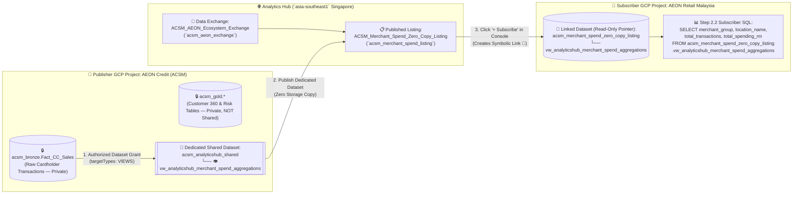
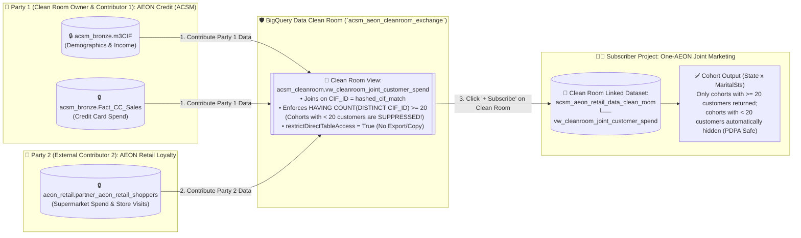

# Track 1 (Notebook 04) Walkthrough: Analytics Hub, Data Clean Rooms & External Datasets

**Notebook**: [`04_Analytics_Hub_Clean_Rooms_and_External_Datasets.ipynb`](../notebook/04_Analytics_Hub_Clean_Rooms_and_External_Datasets.ipynb)
**Target Region**: `asia-southeast1` (Singapore)
**ACSM RFP Clauses**: `C1.1.1.11`–`C1.1.1.13`, `C1.1.5.4`, `C1.2.2.2`

---

## 1. Executive Summary & Customer Context

As part of the **One-AEON Malaysia** ecosystem, ACSM collaborates with sister operating companies (**AEON Retail Malaysia / AEON BiG**) to drive cross-entity loyalty and merchant co-marketing while strictly complying with **Malaysian PDPA 2010** (which prohibits sharing raw customer PII across separate legal entities without consent).

This notebook demonstrates 3 zero-copy data sharing and external enrichment patterns in BigQuery:
1. **Part A — Analytics Hub Zero-Copy Cross-Entity Data Sharing**: Publishing curated merchant spend aggregations from ACSM to AEON Retail with zero data duplication.
2. **Part B — BigQuery Data Clean Room (`k >= 20` Aggregation Threshold)**: Privacy-preserving overlap analysis between `acsm_cleanroom.aeon_credit_cardholders` and `acsm_cleanroom.aeon_retail_loyalty_members` using `SELECT WITH AGGREGATION_THRESHOLD` so cohorts with fewer than 20 customers are automatically suppressed.
3. **Part C — Subscribing to External Google Datasets**: Enriching ACSM internal credit & card data with **Google Search Trends**, **Google Maps / Places POI**, and **Google Ads Campaign Telemetry**.

---

## 2. Step-by-Step Walkthrough

### Step 0 & Step 1: Enable Analytics Hub API & Bootstrap Clean Room / External Datasets
- **What Happens**: Auto-detects `PROJECT_ID` in `asia-southeast1`, enables `analyticshub.googleapis.com`, and executes [`05_cleanroom_and_external_datasets.sql`](../sql/05_cleanroom_and_external_datasets.sql) to provision:
  - `acsm_analyticshub_shared`: Dedicated shared publisher dataset containing `vw_analyticshub_merchant_spend_aggregations`
  - `aeon_retail`: Partner dataset representing **AEON Retail Malaysia** (`aeon_retail.partner_aeon_retail_shoppers`)
  - `acsm_cleanroom`: Clean Room dataset containing the privacy-enforced view `acsm_cleanroom.vw_cleanroom_joint_customer_spend`
  - `acsm_subscribed_data`: External Google datasets (Google Trends, Malaysia Places POI, Google Ads)

### Step 2 (Part A): Analytics Hub Zero-Copy Exchange (`acsm_aeon_exchange`)
- **What Happens**:
  1. **Step 2.1**: Authorizes `acsm_analyticshub_shared` as an **Authorized Dataset** on `acsm_bronze`, creates the `acsm_aeon_exchange` (`ACSM_AEON_Ecosystem_Exchange`) Data Exchange in `asia-southeast1` via `analyticshub.googleapis.com/v1`, and publishes `acsm_merchant_spend_listing` (`ACSM_Merchant_Spend_Zero_Copy_Listing`) sharing `acsm_analyticshub_shared` (so internal `acsm_gold` tables are never exposed to external subscribers).
  2. **Subscribe in Console**: Navigate to **BigQuery Sharing (Analytics Hub) -> Data Exchanges -> `ACSM_AEON_Ecosystem_Exchange` -> `ACSM_Merchant_Spend_Zero_Copy_Listing` -> `+ Subscribe`** and create the Linked Dataset **`acsm_merchant_spend_zero_copy_listing`**.
  3. **Step 2.2**: Queries the subscribed zero-copy Linked Dataset (`acsm_merchant_spend_zero_copy_listing.vw_analyticshub_merchant_spend_aggregations`) without exposing individual cardholder identities.

#### 🖼️ Visual Architecture: How Two GCP Projects Share Data via Analytics Hub (Zero-Copy)



```text
+-------------------------------------------------------+      +------------------------------------------+      +-------------------------------------------------------+
| 🏢 PUBLISHER GCP PROJECT (AEON Credit - ACSM)         |      | 🌐 BIGQUERY ANALYTICS HUB (Singapore)    |      | 🛒 SUBSCRIBER GCP PROJECT (AEON Retail Malaysia)      |
|                                                       |      |                                          |      |  (Simulated in workshop project `aeon-demo-workshop`) |
|  [🔒 acsm_gold.*]  (Private - NEVER shared!)          |      |  Exchange: ACSM_AEON_Ecosystem_Exchange  |      |                                                       |
|                                                       |      |    (`acsm_aeon_exchange`)                |      |  [🔗 acsm_merchant_spend_zero_copy_listing]           |
|  [🔒 acsm_bronze.Fact_CC_Sales] (Raw PII/Txns)        |      |               |                          |      |    └── vw_analyticshub_merchant_spend_aggregations    |
|         |                                             |      |               v                          |      |               |                                       |
|         | 1. Authorized Dataset Grant (VIEWS only)    |      |  Listing:  ACSM_Merchant_Spend_          |      |               | 4. Step 2.2 Live SQL Query            |
|         v                                             |      |            Zero_Copy_Listing             |      |               v    (Zero ETL, Zero Storage Copy!)     |
|  [📂 acsm_analyticshub_shared] (Dedicated Shared DS)  | ===> |            (`acsm_merchant_spend_listing`)| ===> |  📊 Store-Level Spend Summary                         |
|    └── 👁️ vw_analyticshub_merchant_spend_aggregations | 2.   |                                          | 3.   |     (Storage read in ACSM; Compute slot in AEON Retail)|
+-------------------------------------------------------+      +------------------------------------------+      +-------------------------------------------------------+
```

---

### Step 3 (Part B): BigQuery Data Clean Room with Privacy-Preserving Thresholds (`k >= 20`)
- **What Happens**:
  1. **Step 3.1**: Authorizes `acsm_cleanroom` (`targetTypes: ["VIEWS"]`) on both `acsm_bronze` (Party 1) and `aeon_retail` (Party 2), creates the BigQuery Data Clean Room exchange (`acsm_aeon_cleanroom_exchange` / `ACSM_AEON_Retail_Data_Clean_Room` with `sharingEnvironmentConfig.dcrExchangeConfig`) via `analyticshub.googleapis.com/v1`, and publishes the restricted Clean Room listing (`acsm_aeon_joint_customer_cleanroom_listing` with `restrictedExportConfig.enabled = True`) sharing `acsm_cleanroom.vw_cleanroom_joint_customer_spend`.
  2. **Subscribe in Console**: Navigate to **BigQuery Sharing -> Data Clean Rooms -> `ACSM_AEON_Retail_Data_Clean_Room` -> `+ Subscribe`** and create the Clean Room Linked Dataset **`acsm_aeon_retail_data_clean_room`**.
  3. **Step 3.2**: Queries the subscribed Clean Room Linked Dataset (`acsm_aeon_retail_data_clean_room.vw_cleanroom_joint_customer_spend`), which enforces `HAVING COUNT(DISTINCT c.CIF_ID) >= 20` (`Malaysian PDPA Safe`).

#### 👥 Who Does What? Roles & Step-by-Step Workflow for Both Parties
| Role | Organization | Exact Responsibilities & Steps |
| :--- | :--- | :--- |
| **1. Clean Room Owner & Contributor 1** | **AEON Credit Service Malaysia (ACSM)** | 1. Creates the **Data Clean Room** (`ACSM_AEON_Retail_Data_Clean_Room` / `acsm_aeon_cleanroom_exchange`) in BigQuery Sharing.<br/>2. Contributes its Clean Room dataset (`acsm_cleanroom.vw_cleanroom_joint_customer_spend` authorized over `acsm_bronze.m3CIF` and `acsm_bronze.Fact_CC_Sales`) with **Analysis Rules (`k >= 20`)** and **Egress Controls (`restrictDirectTableAccess = True`)**.<br/>3. Invites **AEON Retail Malaysia** (`roles/analyticshub.publisher`) to contribute their loyalty dataset to the Clean Room, and grants Subscriber access (`roles/analyticshub.subscriber`) to the Joint Marketing team. |
| **2. External Data Contributor 2** | **AEON Retail Malaysia (Supermarket & Mall Loyalty)** | 1. Maintains its own private loyalty dataset **`aeon_retail.partner_aeon_retail_shoppers`** (containing `hashed_cif_match`, `retail_spend_amt`, `preferred_aeon_store`, `loyalty_tier`).<br/>2. Contributes **`aeon_retail.partner_aeon_retail_shoppers`** into ACSM's Clean Room with analysis/egress rules so ACSM cannot copy or view individual AEON Retail shopper rows. |
| **3. Clean Room Subscriber** | **One-AEON Joint Marketing / Analytics Team** *(can be analysts in ACSM or AEON Retail)* | 1. Opens **BigQuery Sharing -> Data Clean Rooms -> `ACSM_AEON_Retail_Data_Clean_Room`** and clicks **`+ Subscribe`**.<br/>2. This creates the read-only **Linked Dataset** **`acsm_aeon_retail_data_clean_room`** inside the Subscriber's GCP project.<br/>3. Runs aggregate SQL queries (`Step 3.2`) against **`acsm_aeon_retail_data_clean_room.vw_cleanroom_joint_customer_spend`**. |

#### 🛡️ What Happens If `HAVING COUNT(DISTINCT c.CIF_ID) >= 20` Is False (`< 20` Customers)?
> [!IMPORTANT]
> - **Automatic Row Suppression (Zero Leakage)**: If any `State x MaritalSts` cohort has **fewer than 20 matched customers (`1` to `19` customers)**, BigQuery **automatically suppresses (filters out / omits) that entire cohort row** from the query result!
> - **Why This Matters for Malaysian PDPA 2010**: Suppose an analyst tries to isolate a tiny demographic segment (for example, `State = 'Perlis' AND MaritalSts = 'Widowed'`) that happens to have only **1 or 2 customers**. Without the `>= 20` aggregation threshold, the analyst could deduce that specific person's exact income, credit card spend, and supermarket spend (a *re-identification / differencing attack*). Because `HAVING COUNT(DISTINCT c.CIF_ID) >= 20` is enforced inside the Clean Room view, any group with `< 20` distinct customers returns **no row at all**, guaranteeing that individual customer PII and financial behavior can never be reverse-engineered.

#### 🖼️ Visual Architecture: Multi-Party Collaboration in BigQuery Data Clean Room (`k >= 20`)



```text
+-----------------------------------------------+    +--------------------------------------------------+    +-------------------------------------------------------+
| 🏢 PARTY 1 (OWNER & CONTRIBUTOR 1): ACSM      |    | 🛡️ BIGQUERY DATA CLEAN ROOM (Singapore)          |    | 👩‍💻 SUBSCRIBER PROJECT: One-AEON Joint Marketing       |
|  • 🔒 acsm_bronze.m3CIF (Demographics)        |    |  Clean Room: ACSM_AEON_Retail_Data_Clean_Room    |    |  (Simulated in workshop project `aeon-demo-workshop`) |
|  • 🔒 acsm_bronze.Fact_CC_Sales (Card Spend)  | => |    (`acsm_aeon_cleanroom_exchange`)              |    |                                                       |
+-----------------------------------------------+ 1. |  View: acsm_cleanroom.                           | => |  [🔗 acsm_aeon_retail_data_clean_room]                |
                                                     |        vw_cleanroom_joint_customer_spend         | 3. |    └── vw_cleanroom_joint_customer_spend              |
+-----------------------------------------------+ 2. |    • Joins on CIF_ID = hashed_cif_match          |    |               |                                       |
| 🛒 PARTY 2 (CONTRIBUTOR 2): AEON Retail       | => |    • HAVING COUNT(DISTINCT CIF_ID) >= 20         |    |               v 4. Step 3.2 Privacy-Safe Cohort Query |
|  • 🔒 aeon_retail.                            |    |      (If < 20 customers -> Row is SUPPRESSED!)   |    |  ✅ Returns ONLY cohorts with >= 20 matched customers |
|       partner_aeon_retail_shoppers            |    |    • restrictDirectTableAccess = True            |    |  🚫 Cohorts with < 20 customers are hidden (PDPA Safe)|
+-----------------------------------------------+    +--------------------------------------------------+    +-------------------------------------------------------+
```

---

### Step 4 (Part C): Leveraging Live Public Datasets & Analytics Hub Public Listings (Google Trends, Google Maps Places Insights Malaysia & Google Ads)
- **What Happens**:
  0. **Step 4.0 (`analyticshub_helper.py setup-public-datasets`)**: Automatically subscribes the project via the Analytics Hub API to the official **Google Maps Places Insights — Kuala Lumpur, Malaysia (`MY`) Sample Listing** (`projects/1069876207066/locations/us/dataExchanges/places_insights_sample_exchange/listings/places_insights_sample_my` $\rightarrow$ linked dataset `places_insights___my___sample`), and syncs the live Malaysia slices from `US` public datasets into `acsm_subscribed_data` (`asia-southeast1`) so they can be joined directly in Singapore with `acsm_bronze`.
  1. **Google Search Trends (`Step 4.1a` & `Step 4.1b`)**:
     - **Step 4.1a (`US`)**: Queries `bigquery-public-data.google_trends.international_top_terms` & `international_top_rising_terms` directly (`WHERE country_name = 'Malaysia'`).
     - **Step 4.1b (`asia-southeast1`)**: Joins the live synced Malaysia state trends (`acsm_subscribed_data.google_trends_malaysia_top_terms`) with `acsm_bronze.m3CIF` across all 16 Malaysian states (`MY-01`..`MY-16`).
  2. **Google Maps Places Insights for Malaysia (`Step 4.2a` & `Step 4.2b`)**:
     - **Step 4.2a (`US`)**: Queries the subscribed Analytics Hub linked dataset `places_insights___my___sample.places_sample` directly for Kuala Lumpur operational POIs (`primary_type`, `sublocality_level_1_names`, `accepts_credit_cards`, `accepts_nfc`, `rating`).
     - **Step 4.2b (`asia-southeast1`)**: Joins `acsm_bronze.Fact_CC_Sales` with `acsm_subscribed_data.malaysia_places_insights_kl` by retail category (`primary_type`) to benchmark ACSM card spend against Kuala Lumpur's real merchant density, credit card acceptance, and contactless NFC adoption.
  3. **Google Ads Public Datasets (`Step 4.3a` & `Step 4.3b`)**:
     - **Step 4.3a (`US`)**: Queries `bigquery-public-data.google_ads_transparency_center.creative_stats` directly for verified ad creatives (`ad_format_type`, `topic`, `advertiser_verification_status = 'VERIFIED'`).
     - **Step 4.3b (`asia-southeast1`)**: Performs a **direct zero-copy join in Singapore (`asia-southeast1`)** between the native regional public dataset `bigquery-public-data.google_ads_geo_mapping_asia_southeast1.ads_geo_region_mapping` & `ads_geo_criteria_mapping` (`WHERE target_country_region = 'Malaysia'`), `acsm_subscribed_data.google_ads_transparency_creatives`, `acsm_bronze.m3CIF`, and `acsm_bronze.dimProduct` (`Card_Status = 'Active'`).

#### 🌐 Summary of Live Public Datasets & Analytics Hub Listings Used in Step 4
| External Source | Live Public Dataset / Analytics Hub Listing | Regional Singapore (`asia-southeast1`) Table / Join |
| :--- | :--- | :--- |
| **1. Google Trends (Malaysia)** | `bigquery-public-data.google_trends.international_top_terms` & `international_top_rising_terms` (`WHERE country_name = 'Malaysia'`, `US`) | Synced by `analyticshub_helper.py setup-public-datasets` to `acsm_subscribed_data.google_trends_malaysia_top_terms` (`asia-southeast1`) & joined with `acsm_bronze.m3CIF` (`State`). |
| **2. Google Maps Places Insights (Malaysia `MY`)** | Official Analytics Hub Listing: `projects/1069876207066/locations/us/dataExchanges/places_insights_sample_exchange/listings/places_insights_sample_my` $\rightarrow$ Linked Dataset `places_insights___my___sample.places_sample` (`US`) | Synced by `analyticshub_helper.py setup-public-datasets` to `acsm_subscribed_data.malaysia_places_insights_kl` (`asia-southeast1`) & joined with `acsm_bronze.Fact_CC_Sales` (`LDESC`). |
| **3. Google Ads Public Datasets** | • **Native Singapore (`asia-southeast1`)**: `bigquery-public-data.google_ads_geo_mapping_asia_southeast1.ads_geo_criteria_mapping` & `ads_geo_region_mapping` (`WHERE target_country_region = 'Malaysia'`)<br>• **Live Public Dataset (`US`)**: `bigquery-public-data.google_ads_transparency_center.creative_stats` | Direct zero-copy join in `asia-southeast1` with `acsm_bronze.m3CIF` & `acsm_bronze.dimProduct` (`Wallet_Tier`, `Card_Status = 'Active'`) + `acsm_subscribed_data.google_ads_transparency_creatives`. |


