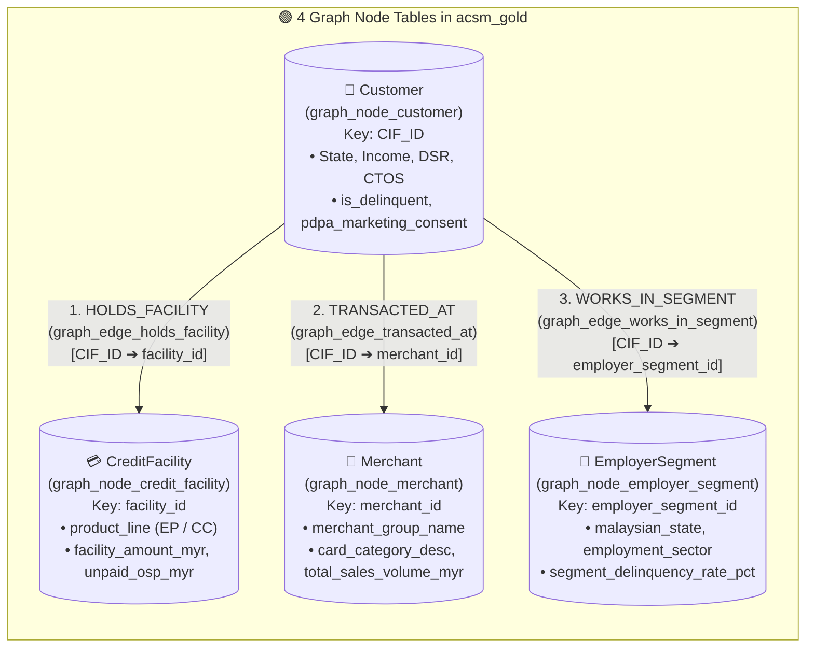

# Track 1 (Notebook 05 — Lab 1.5) Walkthrough: BigQuery Property Graph (`ISO GQL` & Interactive Graph Visualization)

**Notebook**: [`05_BigQuery_Property_Graph.ipynb`](../notebook/05_BigQuery_Property_Graph.ipynb)  
**SQL Script**: [`06_bigquery_graph_and_bqca.sql`](../sql/06_bigquery_graph_and_bqca.sql)  
**Target Region**: `asia-southeast1` (Singapore)  
**ACSM RFP Clauses**: `C1.1.1.14`, `C1.1.1.15`, `C1.1.2.3`, `C1.1.2.4`

---

## 1. Executive Summary & Customer Context

Traditional relational SQL tables require complex multi-way self-joins to uncover **first-party fraud rings, delinquency contagion across shared merchants/employers, and cross-sell paths** between Easy Payment (`EP`) and Credit Card (`CC`) product lines.

This notebook showcases **BigQuery Property Graph (`CREATE OR REPLACE PROPERTY GRAPH` & `ISO/IEC 39075 GQL`)**: zero-ETL graph analytics directly over governed `acsm_gold` tables (`acsm_gold.acsm_credit_ecosystem_graph`) with interactive node-and-edge visualizations (`%%bigquery --graph`) directly inside the notebook—without exporting data to a separate external graph database.

### 🗺️ Visual Architecture: `acsm_gold.acsm_credit_ecosystem_graph` Property Graph Schema (4 Nodes & 3 Directed Edges)



```text
+---------------------------------------------------------------------------------------------------+
|                     BIGQUERY PROPERTY GRAPH: acsm_gold.acsm_credit_ecosystem_graph                |
|                                  (Zero-ETL ISO/IEC 39075 GQL)                                     |
+---------------------------------------------------------------------------------------------------+
|                                                                                                   |
|        [💳 CreditFacility]                                        [🏪 Merchant]                   |
|     (graph_node_credit_facility)                               (graph_node_merchant)              |
|          KEY (facility_id)                                       KEY (merchant_id)                |
|                 ^                                                        ^                        |
|                 |                                                        |                        |
|        [:HOLDS_FACILITY]                                        [:TRANSACTED_AT]                  |
|   (graph_edge_holds_facility)                              (graph_edge_transacted_at)             |
|                 |                                                        |                        |
|                 +----------------------- [👤 Customer] ------------------+                        |
|                                      (graph_node_customer)                                        |
|                                          KEY (CIF_ID)                                             |
|                                                |                                                  |
|                                      [:WORKS_IN_SEGMENT]                                          |
|                                 (graph_edge_works_in_segment)                                     |
|                                                |                                                  |
|                                                v                                                  |
|                                     [🏢 EmployerSegment]                                          |
|                                 (graph_node_employer_segment)                                     |
|                                   KEY (employer_segment_id)                                       |
+---------------------------------------------------------------------------------------------------+
```

---

## 2. Step-by-Step Walkthrough Table

| Step | Notebook Cell / Magic | Capability Demonstrated | What Happens & What You Observe |
| :--- | :--- | :--- | :--- |
| **Step 0** | Python | **Environment Setup & `bigquery-magics>=0.12.1` (`--graph`)** | Auto-detects `PROJECT_ID` (`asia-southeast1`), installs/upgrades `bigquery-magics>=0.12.1`, reloads `%reload_ext bigquery_magics` to unlock `%%bigquery --graph` interactive graph rendering, and enables `bigqueryreservation.googleapis.com` & `dataplex.googleapis.com`. |
| **Step 1.0** | Python (`bigqueryreservation` API) | **Provision BigQuery Enterprise Reservation (`acsm-graph-enterprise-res`)** | Creates an autoscaling **BigQuery Enterprise** slot reservation (`baseline=0`, `max_slots=500`) in `asia-southeast1` and assigns `projects/{PROJECT_ID}` (`jobType=QUERY`), required for `CREATE OR REPLACE PROPERTY GRAPH` and `GRAPH_TABLE` ISO GQL queries. |
| **Step 1.1** | Python (`bq_client`) | **Execute [`06_bigquery_graph_and_bqca.sql`](../sql/06_bigquery_graph_and_bqca.sql)** | Ensures `acsm_bronze`, `acsm_silver`, and `acsm_gold` exist and materializes the **4 Graph Node Tables**, **3 Graph Edge Tables**, and `CREATE OR REPLACE PROPERTY GRAPH acsm_gold.acsm_credit_ecosystem_graph`. |
| **Step 2** | `%%bigquery` | **Audit Property Graph Node & Edge Cardinality** | Queries row counts across all 7 underlying tables (`Customer`, `CreditFacility`, `Merchant`, `EmployerSegment`, `HOLDS_FACILITY`, `TRANSACTED_AT`, `WORKS_IN_SEGMENT`) and explains the interactive `%%bigquery --graph` canvas controls (**Force**, **Hierarchical**, **Sequential**, and **Schema** layouts + right-click node expansion). |
| **Step 3.1** | `%%bigquery --graph` | **ISO GQL Query 1 (Visual Graph) — 2-Hop Customer $\rightarrow$ CreditFacility & Merchant Traversal** | Runs `GRAPH acsm_gold.acsm_credit_ecosystem_graph MATCH p = (f:CreditFacility)<-[h:HOLDS_FACILITY]-(c:Customer)-[t:TRANSACTED_AT]->(m:Merchant) ... RETURN TO_JSON(p) AS path` and renders an interactive node-and-edge graph widget directly inside the notebook. |
| **Step 3.2** | `%%bigquery` | **ISO GQL Query 1 (Tabular Aggregation via `GRAPH_TABLE`)** | Aggregates the 2-hop traversal by Malaysian state, product line (`EP` / `CC`), and AEON privilege merchant group. |
| **Step 4.1** | `%%bigquery --graph` | **ISO GQL Query 2 (Visual Graph) — Multi-Hop First-Party Fraud & Delinquency Contagion Rings** | Matches the cyclical diamond pattern `p1 = (c1:Customer)-[t1:TRANSACTED_AT]->(m:Merchant)<-[t2:TRANSACTED_AT]-(c2:Customer), p2 = (c1)-[w1:WORKS_IN_SEGMENT]->(e:EmployerSegment)<-[w2:WORKS_IN_SEGMENT]-(c2)` where both customers are delinquent (`is_delinquent = TRUE`), returning `TO_JSON(p1), TO_JSON(p2)` for visual ring inspection. |
| **Step 4.2** | `%%bigquery` | **ISO GQL Query 2 (Tabular Ring Ranking via `GRAPH_TABLE`)** | Ranks high-risk merchant + employer delinquency contagion rings by connected delinquent pair count and combined unpaid balance (`pair_unpaid_osp_myr`). |
| **Step 5.1** | `%%bigquery --graph` | **ISO GQL Query 3 (Visual Graph) — AEON Ecosystem Cross-Sell Path Discovery (`EP` $\rightarrow$ `CC`)** | Visualizes the cross-sell graph paths `p = (f:CreditFacility)<-[h:HOLDS_FACILITY]-(c:Customer)-[t:TRANSACTED_AT]->(m:Merchant)` for PDPA-consented (`pdpa_marketing_consent = 'Y'`), zero-delinquency Easy Payment (`EP`) customers with no active Credit Card (`active_card_count = 0`). |
| **Step 5.2** | `%%bigquery` | **ISO GQL Query 3 (Tabular Cross-Sell Candidates via `GRAPH_TABLE`)** | Outputs the prioritized candidate list for instant AEON Credit Card cross-sell at point-of-sale. |
| **Step 6** | Python (`bigqueryreservation` API) | **Cleanup Activity — Delete Enterprise Reservation** | Unassigns `projects/{PROJECT_ID}` and deletes `acsm-graph-enterprise-res` so the project reverts to standard On-Demand query pricing before proceeding to **Notebook 06 (`06_BigQuery_Conversational_Analytics_Agent.ipynb`)**. |

---

## 3. Deep-Dive: ISO GQL Queries & Interactive Graph Visualization (`%%bigquery --graph`)

### 3.1 Property Graph DDL (`CREATE OR REPLACE PROPERTY GRAPH`)
```sql
CREATE OR REPLACE PROPERTY GRAPH `acsm_gold.acsm_credit_ecosystem_graph`
  NODE TABLES (
    `acsm_gold.graph_node_customer`
      KEY (CIF_ID)
      LABEL Customer PROPERTIES ALL COLUMNS,
    `acsm_gold.graph_node_credit_facility`
      KEY (facility_id)
      LABEL CreditFacility PROPERTIES ALL COLUMNS,
    `acsm_gold.graph_node_merchant`
      KEY (merchant_id)
      LABEL Merchant PROPERTIES ALL COLUMNS,
    `acsm_gold.graph_node_employer_segment`
      KEY (employer_segment_id)
      LABEL EmployerSegment PROPERTIES ALL COLUMNS
  )
  EDGE TABLES (
    `acsm_gold.graph_edge_holds_facility`
      KEY (CIF_ID, facility_id)
      SOURCE KEY (CIF_ID) REFERENCES Customer (CIF_ID)
      DESTINATION KEY (facility_id) REFERENCES CreditFacility (facility_id)
      LABEL HOLDS_FACILITY PROPERTIES ALL COLUMNS,
    `acsm_gold.graph_edge_transacted_at`
      KEY (CIF_ID, merchant_id)
      SOURCE KEY (CIF_ID) REFERENCES Customer (CIF_ID)
      DESTINATION KEY (merchant_id) REFERENCES Merchant (merchant_id)
      LABEL TRANSACTED_AT PROPERTIES ALL COLUMNS,
    `acsm_gold.graph_edge_works_in_segment`
      KEY (CIF_ID, employer_segment_id)
      SOURCE KEY (CIF_ID) REFERENCES Customer (CIF_ID)
      DESTINATION KEY (employer_segment_id) REFERENCES EmployerSegment (employer_segment_id)
      LABEL WORKS_IN_SEGMENT PROPERTIES ALL COLUMNS
  );
```

### 3.2 How Interactive Graph Rendering Works (`%%bigquery --graph` + `RETURN TO_JSON(p)`)
Per the official [BigQuery Graph Visualization documentation](https://docs.cloud.google.com/bigquery/docs/graph-visualize-query-results):
- Adding `--graph` to `%%bigquery` (`%%bigquery --graph`) and returning graph path/node/edge elements converted with **`TO_JSON(p)`** renders an interactive graph canvas directly in the notebook cell output.
- You can toggle between **Force**, **Hierarchical**, **Sequential**, and **Schema** layouts, click any node or edge to inspect its properties in the right-hand details pane, or right-click a node to **Expand / Collapse / Show neighbors**.
