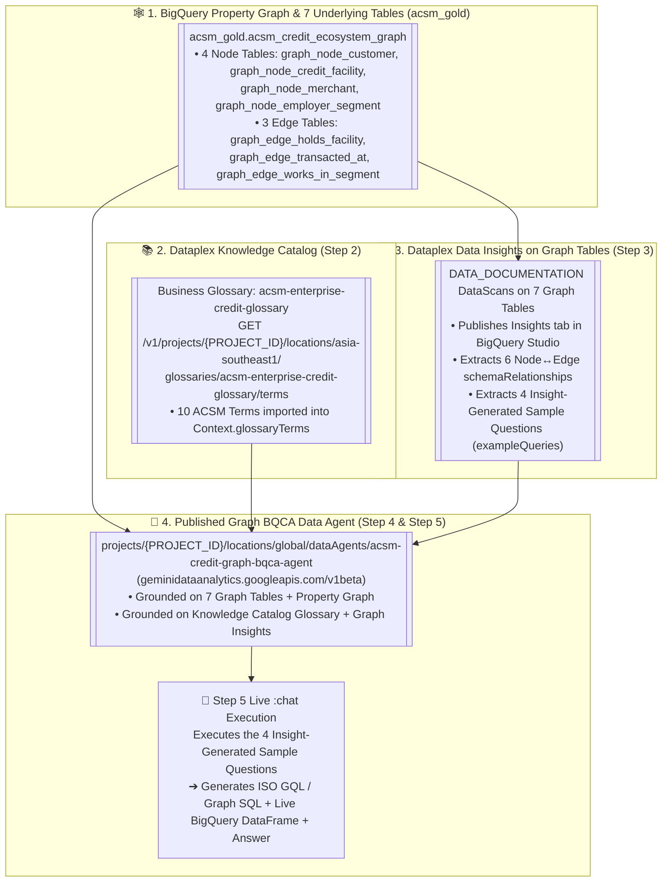

# Track 1 (Notebook 06 — Lab 1.6) Walkthrough: Graph-Based BigQuery Conversational Analytics (BQCA) Data Agent

**Notebook**: [`06_BigQuery_Conversational_Analytics_Agent.ipynb`](../notebook/06_BigQuery_Conversational_Analytics_Agent.ipynb)  
**Declarative Agent Config**: [`track3_self_serve_analytics/bqca_agent_config.yaml`](../../track3_self_serve_analytics/bqca_agent_config.yaml)  
**Knowledge Catalog Glossary YAML**: [`track1_platform_governance/scripts/business_glossary_acsm.yaml`](../scripts/business_glossary_acsm.yaml)  
**Target Region**: `asia-southeast1` (Singapore)  
**ACSM RFP Clauses**: `C1.1.2.9`, `C1.1.2.10`, `C1.1.3.1`, `M1.4.2`, `M1.4.4`

---

## 1. Executive Summary & Architecture

According to **ACSM RFP Operational Drivers (`M1.4.2` & `M1.4.4`)**:
- **65% of ACSM's business users are non-technical** (branch managers, credit officers, collections supervisors, and merchant relationship managers).
- The BI & Data Engineering team handles **~150 ad-hoc data requests per day**, creating a multi-day ticket backlog.

In **Notebook 05**, we built the **BigQuery Property Graph (`acsm_gold.acsm_credit_ecosystem_graph`)** over 4 Node tables (`Customer`, `CreditFacility`, `Merchant`, `EmployerSegment`) and 3 Edge tables (`HOLDS_FACILITY`, `TRANSACTED_AT`, `WORKS_IN_SEGMENT`).

In **Notebook 06**, we focus **exclusively** on creating, grounding, publishing, and querying the **Graph-Based BigQuery Conversational Analytics (`BQCA`) Data Agent (`acsm-credit-graph-bqca-agent`)**:
1. **Live Business Glossary Import from Dataplex Knowledge Catalog (`acsm-enterprise-credit-glossary`)**: Dynamically queries the Dataplex Knowledge Catalog REST API (`GET .../glossaries/acsm-enterprise-credit-glossary/terms`) to import all 10 standardized ACSM Business Terms (`CIF_ID`, `DSR`, `NDI`, `CTOS Score`, `Unpaid OSP`, `PDPA Marketing Consent`, etc.) directly into the agent's `Context.glossaryTerms`.
2. **Dataplex Data Insights (`DATA_DOCUMENTATION`) on the 7 Graph Tables**: Triggers and polls Dataplex Data Insights scans on the 7 Graph Node & Edge tables (`graph_node_*` & `graph_edge_*`), extracting the **6 Node-to-Edge `schemaRelationships`** and **4 Insight-Generated Sample Questions (`exampleQueries`)**.
3. **Live `:chat` Q&A Driven by Graph Table Insights**: Invokes `acsm-credit-graph-bqca-agent:chat` using the exact sample questions generated from the Graph Table Insights.

### 🗺️ Visual Architecture: Grounding the Graph-Based BQCA Agent (`acsm-credit-graph-bqca-agent`)



```text
+-------------------------------------------------------------------------------------------------------+
|              GRAPH-BASED BIGQUERY CONVERSATIONAL ANALYTICS AGENT (acsm-credit-graph-bqca-agent)       |
+-------------------------------------------------------------------------------------------------------+
|                                                                                                       |
|  [🕸️ Step 1: 7 Graph Tables in acsm_gold]      [📚 Step 2: Dataplex Knowledge Catalog API]            |
|   • 4 Node Tables (graph_node_*)                • Glossary: acsm-enterprise-credit-glossary           |
|   • 3 Edge Tables (graph_edge_*)                • Live GET .../glossaries/.../terms                   |
|   • Property Graph: acsm_credit_ecosystem_graph • Imports 10 ACSM Terms -> Context.glossaryTerms      |
|                 |                                                       |                             |
|                 v                                                       |                             |
|  [✨ Step 3: Dataplex Data Insights (DATA_DOCUMENTATION)]               |                             |
|   • Scans all 7 Graph Node & Edge Tables                                |                             |
|   • Extracts 6 Node-to-Edge schemaRelationships                         |                             |
|   • Generates 4 Graph Table Insight Sample Questions (exampleQueries)   |                             |
|                 |                                                       |                             |
|                 +---------------------------+---------------------------+                             |
|                                             |                                                         |
|                                             v                                                         |
|  [🤖 Step 4: Provision & Publish Graph BQCA Agent (geminidataanalytics.googleapis.com/v1beta)]        |
|   • Resource: projects/{PROJECT_ID}/locations/global/dataAgents/acsm-credit-graph-bqca-agent          |
|   • Published to BigQuery Studio (Agents tab)                                                         |
|                                             |                                                         |
|                                             v                                                         |
|  [💬 Step 5: Live Conversational Q&A (:chat) Using the 4 Insight-Generated Sample Questions]          |
|   • Q1: Merchant Delinquency Contagion & Unpaid OSP across TRANSACTED_AT edges                        |
|   • Q2: Customer-to-CreditFacility Exposure & DSR by Product Line across HOLDS_FACILITY edges         |
|   • Q3: Employer & State Segment Delinquency Clusters across WORKS_IN_SEGMENT edges                   |
|   • Q4: PDPA-Consented EP-to-CC Graph Cross-Sell Path Discovery across HOLDS_FACILITY + TRANSACTED_AT |
+-------------------------------------------------------------------------------------------------------+
```

---

## 2. Step-by-Step Walkthrough Table

| Step | Notebook Cell | Capability Demonstrated | What Happens & What You Observe |
| :--- | :--- | :--- | :--- |
| **Step 0** | Python | **Environment Setup & API Enablement** | Auto-detects `PROJECT_ID` (`asia-southeast1`), enables `bigquery.googleapis.com`, `geminidataanalytics.googleapis.com`, `cloudaicompanion.googleapis.com`, `dataplex.googleapis.com`, and `aiplatform.googleapis.com`. |
| **Step 1.1** | Python (`bq_client`) | **Materialize the 7 Graph Node & Edge Tables** | Executes the table & property graph DDL from [`06_bigquery_graph_and_bqca.sql`](../sql/06_bigquery_graph_and_bqca.sql) if `graph_node_customer` is not yet present, ensuring standalone execution. |
| **Step 1.2** | `%%bigquery` | **Audit Graph Node & Edge Table Cardinality** | Verifies row counts across all 4 Node tables (`Customer`, `CreditFacility`, `Merchant`, `EmployerSegment`) and 3 Edge tables (`HOLDS_FACILITY`, `TRANSACTED_AT`, `WORKS_IN_SEGMENT`). |
| **Step 2** | Python (`dataplex.googleapis.com/v1`) | **Import Business Glossary Live from Dataplex Knowledge Catalog (`acsm-enterprise-credit-glossary`)** | Ensures `acsm-enterprise-credit-glossary` is synced in Dataplex Knowledge Catalog (`sync_business_glossary.py`), then calls `GET https://dataplex.googleapis.com/v1/projects/{PROJECT_ID}/locations/asia-southeast1/glossaries/acsm-enterprise-credit-glossary/terms` to dynamically import all **10 ACSM Business Terms** (stripping HTML tags and mapping `displayName` + `description`) into `IMPORTED_GLOSSARY_TERMS` and displays them as a DataFrame. |
| **Step 3** | Python (`dataplex.googleapis.com/v1/projects/.../dataScans`) | **Generate Data Insights on the 7 Graph Tables & Extract Sample Questions** | Creates/triggers **Dataplex `DATA_DOCUMENTATION` (Data Insights)** scans on the 7 Graph tables (`acsm-insights-graph-*`), publishes the `Insights` tab labels to BigQuery Studio, extracts the **6 Node-to-Edge `GRAPH_SCHEMA_RELATIONSHIPS`**, and extracts the **4 Insight-Generated Sample Questions (`INSIGHT_SAMPLE_QUESTIONS`)**. |
| **Step 4** | Python (`geminidataanalytics.googleapis.com/v1beta`) | **Create & Publish Graph-Based BQCA Agent (`acsm-credit-graph-bqca-agent`)** | Provisions and publishes `projects/{PROJECT_ID}/locations/global/dataAgents/acsm-credit-graph-bqca-agent` with `publishedContext` containing:<br>• All 7 Graph Node & Edge tables (`datasourceReferences.bq.tableReferences`)<br>• The 10 imported Knowledge Catalog `glossaryTerms`<br>• The 6 Graph `schemaRelationships`<br>• The 4 Insight-Generated `exampleQueries` |
| **Step 5** | Python (`:chat` Streaming API) | **Live Conversational Q&A Using the 4 Insight-Generated Sample Questions** | Iterates through the 4 `INSIGHT_SAMPLE_QUESTIONS` generated from the Graph Table Insights in Step 3, calling `POST https://geminidataanalytics.googleapis.com/v1beta/projects/{PROJECT_ID}/locations/global:chat` and displaying the agent's generated SQL/GQL, live BigQuery result DataFrame, and natural-language insight summary. |
| **Step 6** | Python (`discoveryengine.googleapis.com/v1alpha`) | **Register BQCA Agent into Gemini Enterprise (`A2A v0.3` + OAuth 2.0)** | Auto-discovers the project's Gemini Enterprise (`APP_TYPE_INTRANET`) engine, configures or reuses OAuth 2.0 authorization (`acsm-bqca-oauth-auth`), builds the A2A v0.3 Agent Card (`a2aAgentDefinition.jsonAgentCard`) pointing to `https://geminidataanalytics.googleapis.com/v1/a2a/projects/{PROJECT_ID}/locations/global/dataAgents/acsm-credit-graph-bqca-agent`, and registers the agent with clickable starter prompts. |

---

## 3. The 4 Sample Questions Generated from Graph Table Insights (Step 3 & Step 5)

| Insight ID | Graph Tables Traversed | Sample Question Asked to `acsm-credit-graph-bqca-agent` |
| :--- | :--- | :--- |
| **`INSIGHT_Q01_MERCHANT_DELINQUENCY_CONTAGION`** | `graph_node_customer` $\xrightarrow{\text{TRANSACTED\_AT}}$ `graph_node_merchant` | *"Which AEON Privilege merchant groups have the highest number of delinquent customers transacting at them in the graph, and what is their total card spend and unpaid balance?"* |
| **`INSIGHT_Q02_CUSTOMER_FACILITY_EXPOSURE_AND_DSR`** | `graph_node_customer` $\xrightarrow{\text{HOLDS\_FACILITY}}$ `graph_node_credit_facility` | *"Across our Customer-to-CreditFacility graph relationships, how many distinct customers, credit facilities, total financed/limit amount, and unpaid OSP exist by product line (EP vs CC) and delinquency status?"* |
| **`INSIGHT_Q03_EMPLOYER_SEGMENT_DELINQUENCY_CLUSTERS`** | `graph_node_customer` $\xrightarrow{\text{WORKS\_IN\_SEGMENT}}$ `graph_node_employer_segment` | *"Using the Customer-to-EmployerSegment graph edges, which Malaysian state and employment sector segments have the highest delinquency rate and unpaid balance exposure?"* |
| **`INSIGHT_Q04_GRAPH_PDPA_EP_TO_CC_CROSS_SELL_PATHS`** | `graph_node_credit_facility` $\xleftarrow{\text{HOLDS\_FACILITY}}$ `graph_node_customer` $\xrightarrow{\text{TRANSACTED\_AT}}$ `graph_node_merchant` | *"Find PDPA-consented Easy Payment (EP) customers in the graph who have zero delinquency, DSR at or below 40%, and no active Credit Card, ranked by their connected AEON merchant spend for Credit Card cross-sell."* |
