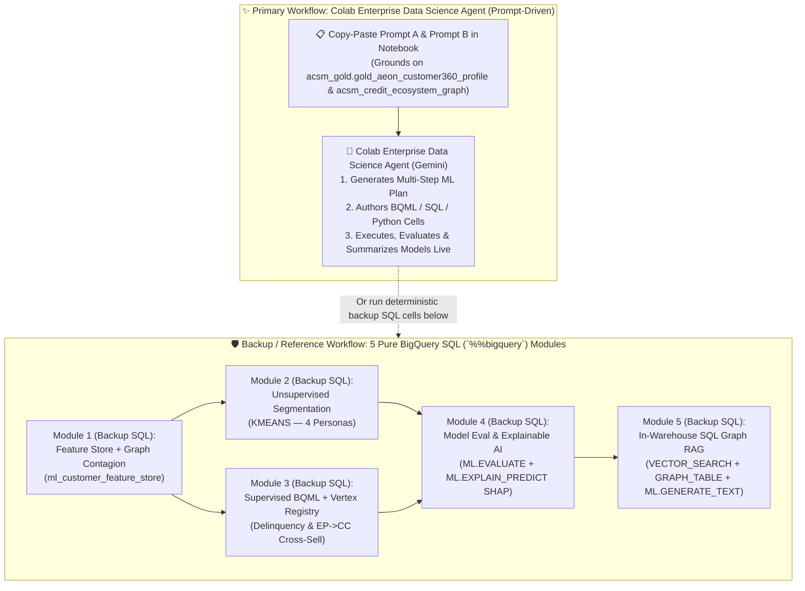

# Track 2 (Notebook 01) Walkthrough: Agentic Data Science & End-to-End BigQuery ML (`BQML` + SQL Graph RAG)

**Notebook**: [`01_BigQuery_ML_Credit_Risk_CrossSell_and_GraphRAG.ipynb`](../notebook/01_BigQuery_ML_Credit_Risk_CrossSell_and_GraphRAG.ipynb)  
**SQL Script**: [`04_bqml_credit_and_cross_sell.sql`](../sql/04_bqml_credit_and_cross_sell.sql)  
**Target Region**: `asia-southeast1` (Singapore)  
**Execution Pattern**: **Prompt-First via Colab Enterprise Data Science Agent (`✨ Gemini`) + 100% Pure BigQuery SQL (`%%bigquery`) Backup Cells**  
**ACSM RFP Clauses**: `C1.1.4.1`–`C1.1.4.10` (Machine Learning & MLOps), `C1.1.3.1` (Agentic Capabilities), `C1.1.3.6` (Vector DB), `Annexure M1.5.1` (Delinquency & Cross-Sell Models)

---

## 1. Executive Summary & Dual-Execution Architecture

AEON Credit Service Malaysia (ACSM)'s data science and credit control teams need to build, evaluate, explain, and operationalize **Customer Segmentation**, **Credit Delinquency & AKPK Restructuring Propensity**, and **Easy Payment (`EP`) $\rightarrow$ Credit Card (`CC`) Cross-Sell** models across `100,000` customers in `acsm_gold.gold_aeon_customer360_profile`—without exporting sensitive financial data out of BigQuery (`asia-southeast1`).

Just like **Track 1 Notebook 02** (which demonstrated the **BigQuery Data Engineering Agent** with pure-SQL backup cells), **Track 2 Notebook 01** uses a **Dual-Execution Architecture**:

1. **✨ Primary Live Demo — Prompt-Driven Data Science Agent (`Colab Enterprise Gemini`)**:
   - Paste **Prompt A** (Predictive BQML, SHAP Explainability & Vertex AI Model Registry) and **Prompt B** (In-Warehouse SQL Graph RAG) into the **Colab Enterprise Data Science Agent (`✨ Gemini`)** panel.
   - Gemini autonomously generates the multi-step ML plan, writes the notebook cells, executes model training & evaluation, and summarizes key customer insights.
2. **🛡️ Deterministic Backup — 5 Pre-Built Pure BigQuery SQL (`%%bigquery`) Modules**:
   - Directly below the prompts in the same notebook, all **5 modules** are pre-built in **100% pure BigQuery SQL (`%%bigquery`)** so you can execute any module deterministically in seconds during the live workshop.



---

## 2. Step-by-Step Walkthrough

### Step 0: Configure Parameters (`asia-southeast1`), Bootstrap Gold & Graph Assets, and Create Vertex AI Remote Models
- **What Happens**:
  1. Auto-detects `PROJECT_ID`, sets `LOCATION = "asia-southeast1"`, and enables `bigquery.googleapis.com`, `bigqueryconnection.googleapis.com`, `aiplatform.googleapis.com`, and `cloudaicompanion.googleapis.com`.
  2. Verifies `acsm_gold.gold_aeon_customer360_profile` (`100,000` customers) and the BigQuery Property Graph `acsm_gold.acsm_credit_ecosystem_graph` exist (automatically running the Track 1 SQL scripts if executed standalone).
  3. Creates/verifies the BigQuery Cloud Resource Connection `asia-southeast1.acsm_vertex_genai_conn`, grants `roles/aiplatform.user` to its service account, and registers two remote Vertex AI models in `acsm_gold`:
     - `acsm_gold.model_vertex_text_embedding` (`ENDPOINT = 'text-embedding-005'`)
     - `acsm_gold.model_gemini_flash` (`ENDPOINT = 'gemini-2.5-flash'`)

---

### Step 1 (Primary Live Demo): Generate the Data Science Notebook via Prompt (`Colab Enterprise Data Science Agent`)
- **Where to Click in BigQuery Studio / Colab Enterprise**:
  1. Open [`01_BigQuery_ML_Credit_Risk_CrossSell_and_GraphRAG.ipynb`](../notebook/01_BigQuery_ML_Credit_Risk_CrossSell_and_GraphRAG.ipynb) in **BigQuery Studio (`Colab Enterprise`)**.
  2. Click the **✨ Gemini (`Data Science Agent`)** button in the bottom-right (or top-right) of the notebook.
  3. Copy and paste **Prompt A** (and then **Prompt B**) below and click **Submit**:

#### 📋 Copy-Paste Prompt A — Predictive BQML, Explainable SHAP & Vertex AI Model Registry
```text
Using BigQuery dataset `acsm_gold` in region `asia-southeast1` (source table `acsm_gold.gold_aeon_customer360_profile` and Property Graph `acsm_gold.acsm_credit_ecosystem_graph`), build and execute a step-by-step BigQuery ML (BQML) workflow for AEON Credit Service Malaysia (ACSM):

1. Feature Store (`acsm_gold.ml_customer_feature_store`):
   Create or replace `acsm_gold.ml_customer_feature_store` combining customer demographics, affordability, credit bureau, and card usage from `acsm_gold.gold_aeon_customer360_profile` (`CIF_ID`, `CIF_NM`, `State`, `Region`, `Occupation`, `N_Age`, `B_NetIncome`, `B_AnnualIncome`, `RecvPromo_FG`, `ep_app_count`, `total_ep_financed_myr`, `avg_ep_dsr`, `cc_app_count`, `total_cc_limit_myr`, `latest_ctos_score`, `active_card_count`, `total_cp_usage_myr`, `total_cp_available_myr`, `combined_unpaid_osp`, `worst_collection_score_grade`) with Property Graph merchant contagion features (`delinquent_exposed_merchants`, `shared_delinquent_peers_count`) from `GRAPH_TABLE(acsm_gold.acsm_credit_ecosystem_graph MATCH (c:Customer)-[:TRANSACTED_AT]->(m:Merchant) ...)`, plus target labels `IF(COALESCE(combined_unpaid_osp, 0) > 0, 1, 0) AS label_is_delinquent` and `IF(COALESCE(active_card_count, 0) > 0, 1, 0) AS label_has_credit_card`.

2. Unsupervised Customer Segmentation (`acsm_gold.model_customer_rfm_kmeans`):
   Train a BigQuery ML `KMEANS` model (`num_clusters = 4`, `standardize_features = TRUE`) on `N_Age`, `B_NetIncome`, `avg_ep_dsr`, `latest_ctos_score`, `total_ep_financed_myr`, and `total_cp_usage_myr`, and query `ML.CENTROIDS` and `ML.PREDICT` to profile the 4 One-AEON customer segments.

3. Supervised Credit Delinquency & Cross-Sell Models (Registered in Vertex AI Model Registry):
   - Train `acsm_gold.model_delinquency_propensity` (`model_type = 'LOGISTIC_REG'`, `input_label_cols = ['label_is_delinquent']`, `auto_class_weights = TRUE`, `max_iterations = 10`, `enable_global_explain = TRUE`, `model_registry = 'VERTEX_AI'`, `vertex_ai_model_id = 'acsm_delinquency_akpk_propensity_v1'`) excluding target-leakage collection columns (`combined_unpaid_osp`, `worst_collection_score_grade`) and protected attributes (`Gender`, `Race`).
   - Train `acsm_gold.model_ep_to_cc_cross_sell` (`model_type = 'LOGISTIC_REG'`, `input_label_cols = ['label_has_credit_card']`, `auto_class_weights = TRUE`, `max_iterations = 10`, `enable_global_explain = TRUE`, `model_registry = 'VERTEX_AI'`, `vertex_ai_model_id = 'acsm_ep_to_cc_cross_sell_v1'`) on performing customers (`WHERE label_is_delinquent = 0`).

4. Model Evaluation & Explainable AI (`ML.EVALUATE` & `ML.EXPLAIN_PREDICT`):
   - Run `ML.EVALUATE` and `ML.GLOBAL_EXPLAIN` on `acsm_gold.model_delinquency_propensity`.
   - Run `ML.EXPLAIN_PREDICT(MODEL acsm_gold.model_delinquency_propensity, TABLE acsm_gold.ml_customer_feature_store, STRUCT(3 AS top_k_features))` joined with `ML.PREDICT(MODEL acsm_gold.model_ep_to_cc_cross_sell, ...)` to materialize `acsm_gold.ml_customer_risk_and_cross_sell_scores`, and display the top 10 highest-risk customers with their top 3 local SHAP attributions and the top 10 EP-to-CC cross-sell candidates.
```

#### 📋 Copy-Paste Prompt B — In-Warehouse SQL Graph RAG (`AI.EMBED` Autonomous Embeddings + `AI.SEARCH` / `VECTOR_SEARCH` + `GRAPH_TABLE` + `AI.GENERATE`)
```text
Now extend the workflow with an in-warehouse BigQuery ML Graph RAG pipeline in `asia-southeast1`:
1. Create a regulatory policy knowledge base table `acsm_gold.bnm_rmit_akpk_policy_kb_autonomous` containing Bank Negara Malaysia (BNM) Responsible Financing (DSR > 60%), AKPK Debt Management Programme (DMP), Merchant Delinquency Contagion Ring, One-AEON Cross-Sell, and Malaysian PDPA Section 43 guidelines with Autonomous Embedding Generation enabled (`content_embedding STRUCT<result ARRAY<FLOAT64>, status STRING> GENERATED ALWAYS AS (AI.EMBED(content, connection_id => 'asia-southeast1.acsm_vertex_genai_conn', endpoint => 'text-embedding-005')) STORED OPTIONS (asynchronous = TRUE)`), and query it using `AI.SEARCH(TABLE acsm_gold.bnm_rmit_akpk_policy_kb_autonomous, 'content', 'High DSR > 60% delinquent customer with Unpaid OSP seeking AKPK Debt Management Programme restructuring', top_k => 2)` so BigQuery embeds both the table and the search query automatically.
2. Join the top 5 high-risk delinquent customers from `acsm_gold.ml_customer_risk_and_cross_sell_scores` (including their top 3 local SHAP feature attributions) with their 2-hop credit facility and merchant exposure from `GRAPH_TABLE(acsm_gold.acsm_credit_ecosystem_graph MATCH (f:CreditFacility)<-[:HOLDS_FACILITY]-(c:Customer)-[:TRANSACTED_AT]->(m:Merchant) ...)` and retrieve the matching BNM/AKPK policy clause.
3. Call `AI.GENERATE` (or `ML.GENERATE_TEXT`) with `gemini-2.5-flash` to generate a concise, regulator-compliant Credit Control & AKPK Restructuring Action Plan for each flagged customer.
```

---

### Step 2 (Backup / Deterministic Code): 5 Pre-Built Pure BigQuery SQL (`%%bigquery`) Modules

If you want instant, deterministic execution during the live workshop without waiting for agent code generation, execute the **5 Backup SQL Modules** directly in the notebook:

- **Backup Module 1 (`Cells 1.1–1.2` — Feature Store + Graph Contagion Feature)**:
  - Builds `acsm_gold.ml_customer_feature_store` (`100,000` customers) combining Customer 360 features with `delinquent_exposed_merchants` and `shared_delinquent_peers_count` extracted via `GRAPH_TABLE(acsm_gold.acsm_credit_ecosystem_graph ...)`.
- **Backup Module 2 (`Cells 2.1–2.2` — Unsupervised Customer Segmentation via `KMEANS`)**:
  - Trains `acsm_gold.model_customer_rfm_kmeans` (`num_clusters = 4`, `standardize_features = TRUE`) and profiles the 4 customer clusters using `ML.CENTROIDS` and `ML.PREDICT`.
- **Backup Module 3 (`Cells 3.1–3.2` — Supervised Delinquency & Cross-Sell Models in Vertex AI Model Registry)**:
  - Trains `acsm_gold.model_delinquency_propensity` (`vertex_ai_model_id = 'acsm_delinquency_akpk_propensity_v1'`) and `acsm_gold.model_ep_to_cc_cross_sell` (`vertex_ai_model_id = 'acsm_ep_to_cc_cross_sell_v1'`).
- **Backup Module 4 (`Cells 4.1–4.4` — Model Evaluation & Local SHAP Explainability via `ML.EXPLAIN_PREDICT`)**:
  - Evaluates ROC AUC, precision, recall, and global feature importance (`ML.EVALUATE`, `ML.GLOBAL_EXPLAIN`).
  - Materializes `acsm_gold.ml_customer_risk_and_cross_sell_scores` with per-customer **Top 3 Local SHAP Feature Attributions (`top_1_shap_reason`, `top_2_shap_reason`, `top_3_shap_reason`)** and ranks:
    1. Top 10 High-Risk Customers for **Proactive AKPK Debt Restructuring**.
    2. Top 10 Prime **Easy Payment (`EP`)-Only Customers** (`active_card_count = 0`, `RecvPromo_FG = 'Y'`) for **AEON Credit Card Fast-Track Cross-Sell**.
- **Backup Module 5 (`Cells 5.1a–5.2` — Capstone: In-Warehouse SQL Graph RAG with `AI.EMBED` + `AI.SEARCH` + `GRAPH_TABLE` + `ML.GENERATE_TEXT`)**:
  - **Module 5.1a (`Autonomous Embedding Generation — AI.EMBED`)**: Creates `acsm_gold.bnm_rmit_akpk_policy_kb_autonomous` with `GENERATED ALWAYS AS (AI.EMBED(content, connection_id => 'asia-southeast1.acsm_vertex_genai_conn', endpoint => 'text-embedding-005')) STORED OPTIONS (asynchronous = TRUE)` so BigQuery automatically generates and updates embeddings in the background whenever policy rows are inserted or modified.
  - **Module 5.1b (`Zero-Embedding-Code Search — AI.SEARCH`)**: Queries `AI.SEARCH(TABLE acsm_gold.bnm_rmit_akpk_policy_kb_autonomous, 'content', '<plain_text_query>', top_k => 3)`—passing plain text directly without any manual query-embedding step.
  - **Module 5.2 (`Multi-Customer SQL Graph RAG`)**: Runs a **single BigQuery SQL query** that joins:
    1. **Tabular ML + SHAP Risk Drivers** (`ML.EXPLAIN_PREDICT` from Module 4)
    2. **2-Hop Property Graph Network Context** (`GRAPH_TABLE(acsm_gold.acsm_credit_ecosystem_graph MATCH (f:CreditFacility)<-[:HOLDS_FACILITY]-(c:Customer)-[:TRANSACTED_AT]->(m:Merchant))`)
    3. **Vector Policy Retrieval** (`VECTOR_SEARCH` / `AI.SEARCH`)
    4. **Generative AI Synthesis** (`ML.GENERATE_TEXT` / `AI.GENERATE` with `Gemini 2.5 Flash`) to produce an audit-ready **Credit Control & AKPK Restructuring Action Plan** per customer.

---

## 3. ACSM RFP Requirements Coverage Matrix

| RFP Clause | Requirement Name | How Track 2 Notebook 01 Demonstrates Compliance |
| :--- | :--- | :--- |
| **`C1.1.4.1`** | **Framework Integration** | Combines BigQuery Studio Colab Enterprise Data Science Agent (`✨ Gemini`), BigQuery ML (`%%bigquery`), Property Graph (`ISO GQL`), and Vertex AI in one notebook. |
| **`C1.1.4.2`** | **Feature Engineering** | Builds `acsm_gold.ml_customer_feature_store` combining Customer 360 affordability/bureau metrics with Property Graph merchant contagion features. |
| **`C1.1.4.3`** | **Resource Provisioning** | Runs on serverless BigQuery slots and auto-scaling Colab Enterprise runtimes in `asia-southeast1` (Singapore). |
| **`C1.1.4.4`** | **MLOps Lifecycle** | Covers end-to-end Feature Store $\rightarrow$ Training (`CREATE OR REPLACE MODEL`) $\rightarrow$ Evaluation (`ML.EVALUATE`) $\rightarrow$ Vertex AI Model Registry $\rightarrow$ Batch Explainable Scoring (`ML.EXPLAIN_PREDICT`). |
| **`C1.1.4.6` & `C1.1.4.10`** | **Model Tracking & Governance** | Registers models directly into **Vertex AI Model Registry** (`model_registry = 'VERTEX_AI'`) while keeping models governed in `acsm_gold` under Dataplex lineage. |
| **`C1.1.4.7`** | **Experiment Tracking** | Tracks evaluation metrics (`roc_auc`, `precision`, `recall`, `f1_score`, `log_loss`) via `ML.EVALUATE` and `ML.TRAINING_INFO`. |
| **`C1.1.4.8`** | **Model Portability** | Supports 1-command `EXPORT MODEL` to Cloud Storage (`gs://...`) for portable container or external deployment. |
| **`C1.1.4.9`** | **Explainable AI (XAI)** | Uses `ML.GLOBAL_EXPLAIN` (model-level importance) and `ML.EXPLAIN_PREDICT` (`STRUCT(3 AS top_k_features)`) to output per-customer local SHAP attributions for BNM RMiT auditability. |
| **`C1.1.3.1` & `C1.1.3.6`** | **Agentic Capabilities & Vector DB** | Showcases the **Colab Enterprise Data Science Agent** and **In-Warehouse SQL Graph RAG** (`ML.GENERATE_EMBEDDING` + `VECTOR_SEARCH` + `GRAPH_TABLE` + `ML.GENERATE_TEXT`). |
| **`Annexure M1.5.1`** | **Delinquency & Cross-Sell Models** | Delivers Unsupervised Customer Segmentation (`KMEANS`), Credit Delinquency/AKPK Propensity (`model_delinquency_propensity`), and EP $\rightarrow$ CC Cross-Sell (`model_ep_to_cc_cross_sell`). |
