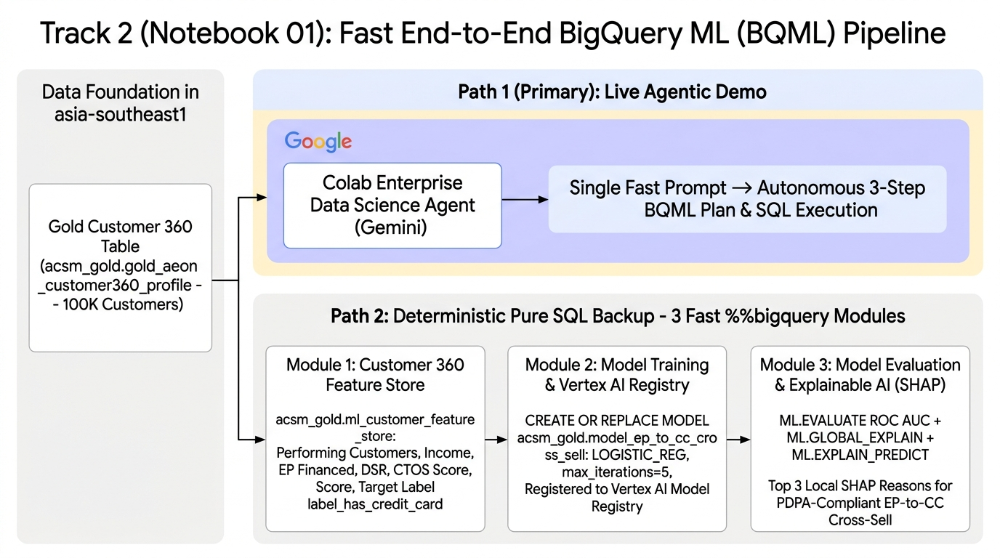
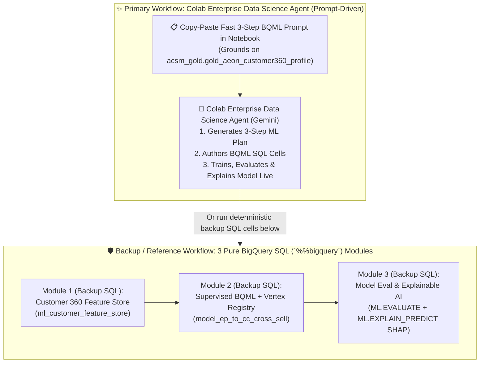

# Track 2 (Notebook 01) Walkthrough: Agentic Data Science & Fast End-to-End BigQuery ML (`EP-to-CC Cross-Sell Pipeline`)

**Notebook**: [`01_BigQuery_ML_Credit_Risk_CrossSell_and_GraphRAG.ipynb`](../notebook/01_BigQuery_ML_Credit_Risk_CrossSell_and_GraphRAG.ipynb)  
**SQL Script**: [`04_bqml_credit_and_cross_sell.sql`](../sql/04_bqml_credit_and_cross_sell.sql)  
**Target Region**: `asia-southeast1` (Singapore)  
**Execution Pattern**: **Prompt-First via Colab Enterprise Data Science Agent (`✨ Gemini`) + 100% Pure BigQuery SQL (`%%bigquery`) Backup Cells**  
**ACSM RFP Clauses**: `C1.1.4.1`–`C1.1.4.10` (Machine Learning & MLOps), `C1.1.3.1` (Agentic Capabilities), `C1.1.3.8` (Distributed Training), `Annexure M1.5.1` (Cross-Sell Propensity Modeling)

---

## 1. Executive Summary & Dual-Execution Architecture

AEON Credit Service Malaysia (ACSM)'s data science and credit control teams need a fast, governed, end-to-end **BigQuery ML (`BQML`)** workflow to build, register, evaluate, and explain an **Easy Payment (`EP`) $\rightarrow$ Credit Card (`CC`) Cross-Sell Propensity** model across `acsm_gold.gold_aeon_customer360_profile`—without exporting sensitive financial data out of BigQuery (`asia-southeast1`).

Just like **Track 1 Notebook 02** (which demonstrated the **BigQuery Data Engineering Agent** with pure-SQL backup cells), **Track 2 Notebook 01** uses a **Dual-Execution Architecture**:

1. **✨ Primary Live Demo — Prompt-Driven Data Science Agent (`Colab Enterprise Gemini`)**:
   - Paste the **Fast End-to-End BQML, SHAP Explainability & Vertex AI Model Registry Prompt** into the **Colab Enterprise Data Science Agent (`✨ Gemini`)** panel.
   - Gemini autonomously generates the 3-step ML plan, writes the SQL cells, executes model training & evaluation, and outputs the top 15 cross-sell candidates with local SHAP explanations.
2. **🛡️ Deterministic Backup — 3 Pre-Built Pure BigQuery SQL (`%%bigquery`) Modules**:
   - Directly below the prompt in the same notebook, all **3 modules** are pre-built in **100% pure BigQuery SQL (`%%bigquery`)** so you can execute any module deterministically in seconds during the live workshop.





---

## 2. Step-by-Step Walkthrough

### Step 0: Configure Parameters (`asia-southeast1`) & Verify Gold Customer 360 Table
- **What Happens**:
  1. Auto-detects `PROJECT_ID`, sets `LOCATION = "asia-southeast1"`, and enables `bigquery.googleapis.com`, `aiplatform.googleapis.com`, and `cloudaicompanion.googleapis.com`.
  2. Standardizes `acsm_gold.gold_aeon_customer360_profile` (`100,000` customers, `22` columns) so downstream ML feature engineering runs cleanly even if Track 2 is launched standalone.

---

### Step 1 (Primary Live Demo): Generate the Data Science Notebook via Prompt (`Colab Enterprise Data Science Agent`)
- **Where to Click in BigQuery Studio / Colab Enterprise**:
  1. Open [`01_BigQuery_ML_Credit_Risk_CrossSell_and_GraphRAG.ipynb`](../notebook/01_BigQuery_ML_Credit_Risk_CrossSell_and_GraphRAG.ipynb) in **BigQuery Studio (`Colab Enterprise`)**.
  2. Click the **✨ Gemini (`Data Science Agent`)** button in the bottom-right (or top-right) of the notebook.
  3. Copy and paste the **Fast End-to-End BQML Prompt** below and click **Submit**:

#### 📋 Copy-Paste Prompt — Next-Best-Product Propensity Model
```text
Develop a propensity model for AEON Credit to predict the 'Next Best Product' for customers using `acsm_gold.gold_aeon_customer360_profile` in `asia-southeast1`. This involves exploring customer demographic and transaction data from BigQuery, deploying the model in BQML and Vertex AI, and doing tuning and experiments for the model.
```

---

### Step 2 (Backup / Deterministic Code): 3 Pre-Built Pure BigQuery SQL (`%%bigquery`) Modules

If you want instant, deterministic execution during the live workshop without waiting for agent code generation, execute the **3 Backup SQL Modules** directly in the notebook:

- **Backup Module 1 (`Cells 1.1–1.2` — Customer 360 Feature Store)**:
  - Builds `acsm_gold.ml_customer_feature_store` directly from `acsm_gold.gold_aeon_customer360_profile` for performing customers (`WHERE COALESCE(combined_unpaid_osp, 0) = 0`) with `label_has_credit_card`.
- **Backup Module 2 (`Cell 2.1` — Supervised Cross-Sell Model in Vertex AI Model Registry)**:
  - Trains `acsm_gold.model_ep_to_cc_cross_sell` (`max_iterations = 5`, `enable_global_explain = TRUE`, `vertex_ai_model_id = 'acsm_ep_to_cc_cross_sell_v1'`).
- **Backup Module 3 (`Cells 3.1–3.3` — Model Evaluation & Local SHAP Explainability via `ML.EXPLAIN_PREDICT`)**:
  - Evaluates ROC AUC, precision, recall, and global feature importance (`ML.EVALUATE`, `ML.GLOBAL_EXPLAIN`).
  - Runs `ML.EXPLAIN_PREDICT` (`STRUCT(3 AS top_k_features)`) on eligible **Easy Payment (`EP`)-Only Customers** (`active_card_count = 0`, `ep_app_count > 0`, `RecvPromo_FG = 'Y'`) to rank the **Top 15 Pre-Qualified AEON Credit Card Cross-Sell Candidates** with their **Top 3 Local SHAP Feature Attributions**.

---

## 3. ACSM RFP Requirements Coverage Matrix

| RFP Clause | Requirement Name | How Track 2 Notebook 01 Demonstrates Compliance |
| :--- | :--- | :--- |
| **`C1.1.4.1`** | **Framework Integration** | Combines BigQuery Studio Colab Enterprise Data Science Agent (`✨ Gemini`), BigQuery ML (`%%bigquery`), and Vertex AI in one notebook. |
| **`C1.1.4.2`** | **Feature Engineering** | Builds `acsm_gold.ml_customer_feature_store` from Customer 360 affordability, bureau, and EP financing metrics. |
| **`C1.1.4.3`** | **Resource Provisioning** | Runs on serverless BigQuery slots and auto-scaling Colab Enterprise runtimes in `asia-southeast1` (Singapore). |
| **`C1.1.4.4`** | **MLOps Lifecycle** | Covers end-to-end Feature Store $\rightarrow$ Training (`CREATE OR REPLACE MODEL`) $\rightarrow$ Evaluation (`ML.EVALUATE`) $\rightarrow$ Vertex AI Model Registry $\rightarrow$ Explainable Scoring (`ML.EXPLAIN_PREDICT`). |
| **`C1.1.4.6` & `C1.1.4.10`** | **Model Tracking & Governance** | Registers `model_ep_to_cc_cross_sell` directly into **Vertex AI Model Registry** (`model_registry = 'VERTEX_AI'`) while keeping the model governed in `acsm_gold` under Dataplex lineage. |
| **`C1.1.4.7`** | **Experiment Tracking** | Tracks evaluation metrics (`roc_auc`, `precision`, `recall`, `f1_score`, `log_loss`) via `ML.EVALUATE`. |
| **`C1.1.4.8`** | **Model Portability** | Supports 1-command `EXPORT MODEL` to Cloud Storage (`gs://...`) for portable container or external deployment. |
| **`C1.1.4.9`** | **Explainable AI (XAI)** | Uses `ML.GLOBAL_EXPLAIN` (model-level importance) and `ML.EXPLAIN_PREDICT` (`STRUCT(3 AS top_k_features)`) to output per-customer local SHAP attributions for BNM RMiT auditability. |
| **`C1.1.3.1`** | **Agentic Capabilities** | Showcases the **Colab Enterprise Data Science Agent (`✨ Gemini`)** autonomously generating and executing the end-to-end ML workflow. |
| **`Annexure M1.5.1`** | **Cross-Sell Propensity Modeling** | Delivers the One-AEON Easy Payment (`EP`) $\rightarrow$ Credit Card (`CC`) Cross-Sell Propensity model (`model_ep_to_cc_cross_sell`). |
